# 神经网络基础

## 神经网络的构成

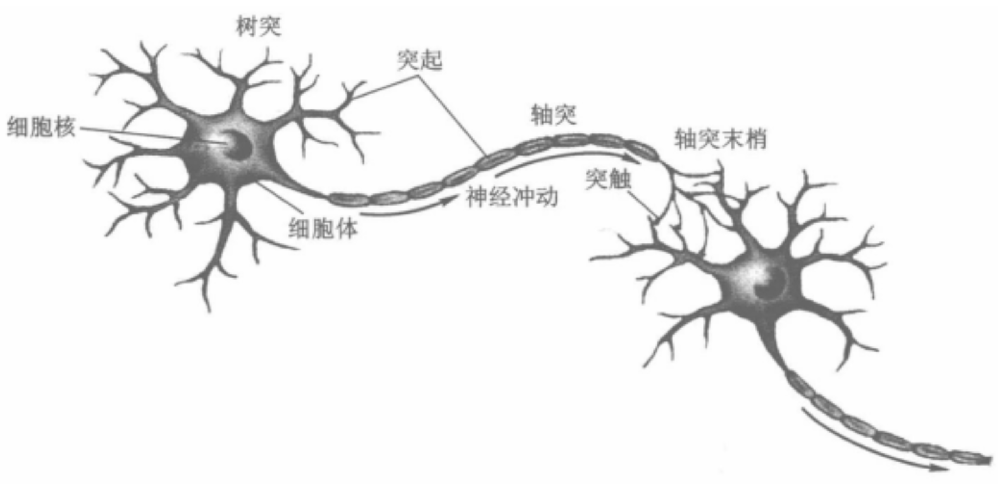

在生物体中，神经元 是神经系统最基本的结构和功能单位。

神经元从树突接收其它神经元细胞发出的电化学刺激脉冲，这些脉冲叠加后，一旦强度达到临界值，这个神经元就会产生动作电位，沿着轴突发送电信号。

轴突将刺激传到末端的突触，电信号触发突触上面的电压敏感蛋白，把一个内含神经递质的小泡（突触小体）推到突触的膜上，从而释放出突触小体中的神经递质。这些化学物质会扩散到其它神经元的树突或轴突上。

### 基本概念

人工神经网络（Artificial Neural Network，ANN）简称 神经网络（NN），是一种模仿生物神经网络结构和功能的计算模型。大多数情况下人工神经网络能在外界信息的基础上改变内部结构，是一种自适应系统(adaptive system)，通俗地讲就是具备学习功能。

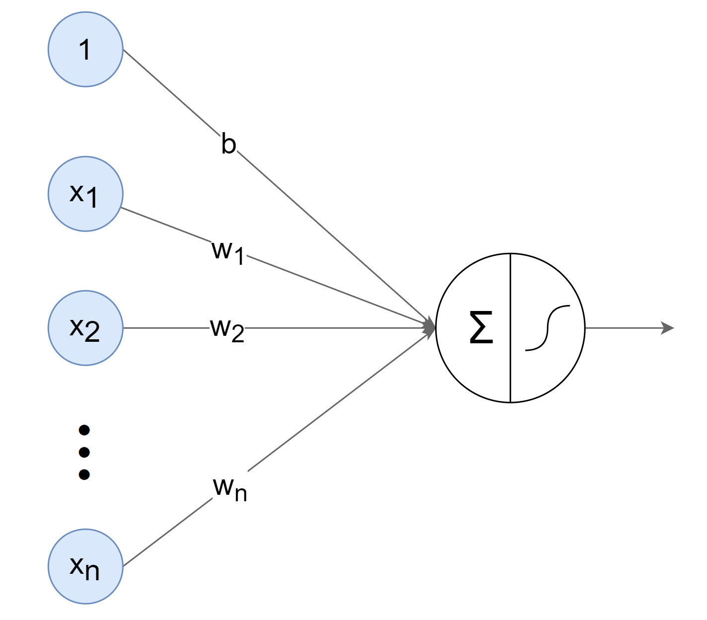

人工神经网络中的神经元，一般可以对多个输入进行加权求和，再经过特定的“激活函数”转换后输出。

### 基本结构

使用多个神经元就可以构建多层神经网络，通常将其称之为 模型（Model）。最左边的一列神经元都表示输入，称为 输入层；最右边一列表示网络的输出，称为 输出层；输入层与输出层之间的层统称为 中间层（隐藏层）。

相邻层的神经元相互连接（图中下一层每个神经元都与上一层所有神经元连接，称为 全连接），每个连接都会有一个 权重。

神经元中的信息逐层传递（一般称为 前向传播forward），上一层神经元的输出作为下一层神经元的输入。

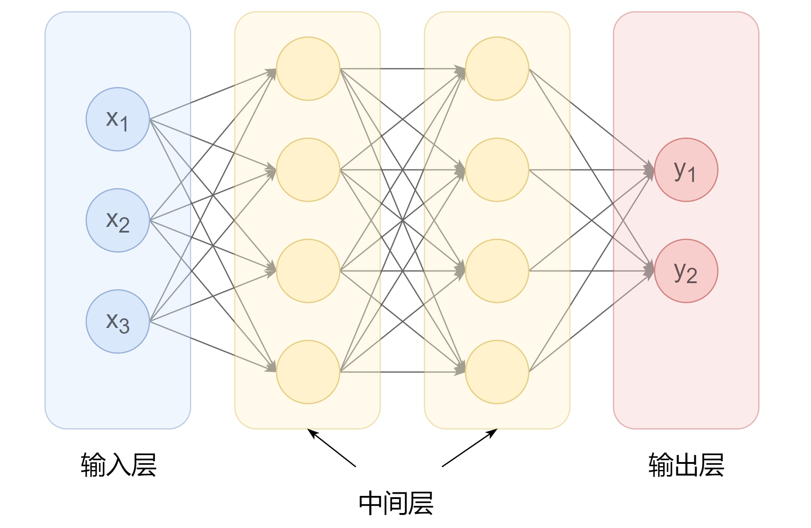

整个模型接受原始 输入（特征），生成 输出（预测），并包含一些 参数。神经网络中的参数，主要就是每一层的权重和偏置。

## 全连接层

PyTorch提供了torch.nn模块，专门用于神经网络的构建和训练。而神经网络中每一个计算操作，都被定义为一个类，一般也称为“层”（Layer）。

最基本的操作，就是相邻两层间的神经元相互连接、加权求和，这被称为“全连接层”，也叫做“线性层”（Linear）或“仿射层”（Affine）。

### 基本原理

下图就表示了一个全连接层，输入有两个神经元$x_{1}、x_{2}$，输出有三个神经元$y_{1}、y_{2}、y_{3}$。所有输入神经元$x_{i}$和输出神经元$y_{j}$都相互连接，并有一个权重$w_{ij}$；此外还会有一个偏置项${ b}_{j}$，分别叠加在每个输出上。

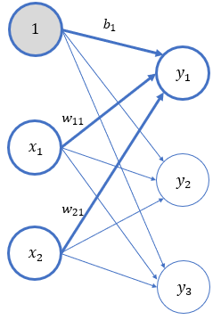

对于第1个输出神经元，可以得到：

$y_{1}=w_{11}x_{1}+w_{21}x_{2}+ b_{1}$

同样，对于第2个、第3个输出神经元，有：

$y_{2}=w_{12}x_{1}+w_{22}x_{2}+ b_{2}$

$y_{3}=w_{13}x_{1}+w_{23}x_{2}+ b_{3}$

我们可以直接写成矩阵乘法的形式：

$Y=XW+B$

其中，

$$
Y=\left( y_{1}  y_{2}  y_{3} \right),  X=\left( x_{1}  x_{2} \right),  B=\left( b_{1}  b_{2}  b_{3} \right),
$$

$$
W=\left( \begin{matrix} w_{11} & w_{12} & w_{13} \\ w_{21} & w_{22} & w_{23} \end{matrix} \right)
$$

可以看到，由于有2个输入节点、3个第1层节点，所以全连接层的权重W就应该是一个2×3的矩阵。

### API调用（nn.Linear）

在PyTorch中，全连接层被实现为Linear类，内部有两个属性：权重 weight和偏置bias；这就是神经网络的主要参数。

```python
import torch.nn as nn

linear = nn.Linear(2, 3)
```

上面代码中，Linear初始化时传入了两个参数in_features、out_features，定义了一个有2个输入神经元、3个输出神经元的全连接层。需要注意的是，Linear中的weight属性，形状为 (out_features, in_features)，也就是上文中数学表示中W的转置。

调用Linear类的forward方法，就可以实现全连接层的前向传播：

```python
y = linear.forward(x)
# x: 输入数据[*, in_features]
# y: 输出数据[*, out_features]
```

这里x是输入数据，形状一般为( N, in_features )，其中N是输入数据样本的个数；y是输出数据，形状一般为( N, out_features )。

在PyTorch中，nn中所有模块的__call__方法，都会指向自身的forward方法，因此前向传播的代码可以简写为：

```python
y = linear(x)
```

## 激活函数

### 基本概念和作用

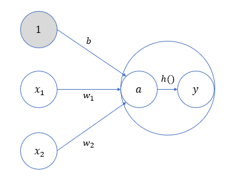

对于一个有两个输入$x_{1}、x_{2}$的神经元，我们将输入信号和偏置$b$的加权总和，记作 $a$；那么神经元的输出$y$可以写做：

$a=w_{1}x_{1}+w_{2}x_{2}+b$

$y=h(a)$

这里的 $h(x)$ 可以将输入信号的加权总和转换为输出信号，起到“激活神经元”的作用，所以被称为 激活函数。

激活函数是连接感知机和神经网络的桥梁，在神经网络中起着至关重要的作用。

如果没有激活函数，整个神经网络就等效于单层线性变换，不论如何加深层数，总是存在与之等效的“无隐藏层的神经网络”。激活函数必须是非线性函数，也正是激活函数的存在为神经网络引入了非线性，使得神经网络能够学习和表示复杂的非线性关系。

### 阶跃（Binary step）函数

最简单的激活函数可以为输入设置一个“阈值”；一旦超过这个阈值，就切换输出（0或者1）。这种函数被称为“阶跃函数”。

$$
f\left( x \right)=\left( \begin{aligned} 0,x<0 \\ 1, x≥0 \end{aligned} \right),  f^{'}\left( x \right)=0
$$

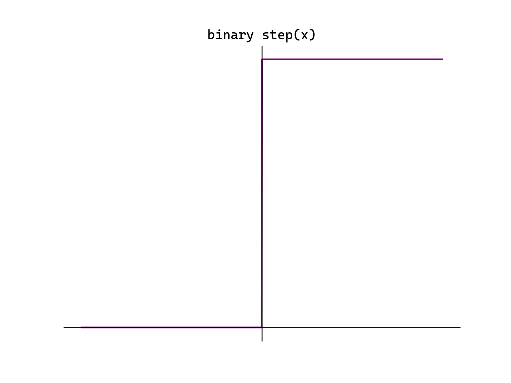

阶跃函数的导数恒为0，一般不会用在神经网络中。

### Sigmoid函数

$$
f\left( x \right)=\frac{1}{1+e^{-x}}
$$

$$
f^{'}\left( x \right)=\frac{1}{1+e^{-x}}\left( 1-\frac{1}{1+e^{-x}} \right)=f\left( x \right)\left( 1-f\left( x \right) \right)
$$

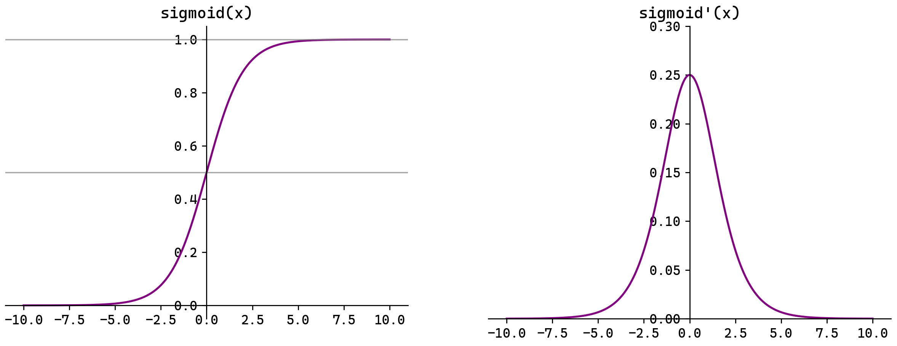

Sigmoid（也叫Logistic函数）是平滑的、可微的，能将任意输入映射到区间(0,1)。常用于二分类的输出层。但因其涉及指数运算，计算量相对较高。

Sigmoid的输入在[-6,6]之外时，其输出值变化很小，可能导致信息丢失。

Sigmoid的输出并非以0为中心，其输出值均＞0，导致后续层的输入始终为正，可能影响后续梯度更新方向。

Sigmoid的导数范围为(0,0.25)，梯度较小。当输入在[-6,6]之外时，导数接近0，此时网络参数的更新将会极其缓慢。使用Sigmoid作为激活函数，可能出现梯度消失（在逐层反向传播时，梯度会呈指数级衰减）。

PyTorch中提供了各种常见的激活函数，可以用两种方式调用：

```python
y = torch.sigmoid(x)
y = x.sigmoid()
```

这里的x是输入数据，可以是任意形状的张量（Tenosr），输出y与x形状相同。

另外，PyTorch的torch.nn模块中把所有计算操作都定义为一个类，因此激活函数也可以用类似之前全连接层的方式来定义和调用：

```python
sig = torch.nn.Sigmoid()
y = sig(x)
```

### Tanh函数

$$
f\left( x \right)=\frac{1-e^{-2x}}{1+e^{-2x}}
$$

$$
f^{'}\left( x \right)=1-{\left( \frac{1-e^{-2x}}{1+e^{-2x}} \right)}^{2}=1-f^{2}\left( x \right)
$$

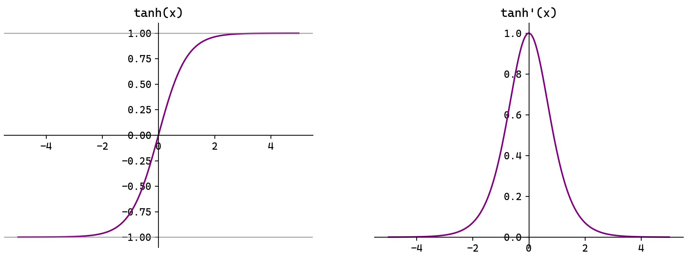

Tanh（双曲正切）将输入映射到区间(-1,1)。其关于原点中心对称。常用在隐藏层。

输入在[-3,3]之外时，Tanh的输出值变化很小，此时其导数接近0。

Tanh的输出以0为中心，且其梯度相较于Sigmoid更大，收敛速度相对更快。但同样也存在梯度消失现象。

### ReLU函数

$$
f\left( x \right)=\max\left( 0,x \right)= \left( \begin{aligned} 0,x≤0 \\ x,x>0 \end{aligned} \right)
$$

$$
f^{'\left( x \right)}=\left( \begin{aligned} 0,x≤0 \\ 1,x>0 \end{aligned} \right)
$$

注意：x=0时ReLU函数不可导，此时我们默认使用左侧的函数。

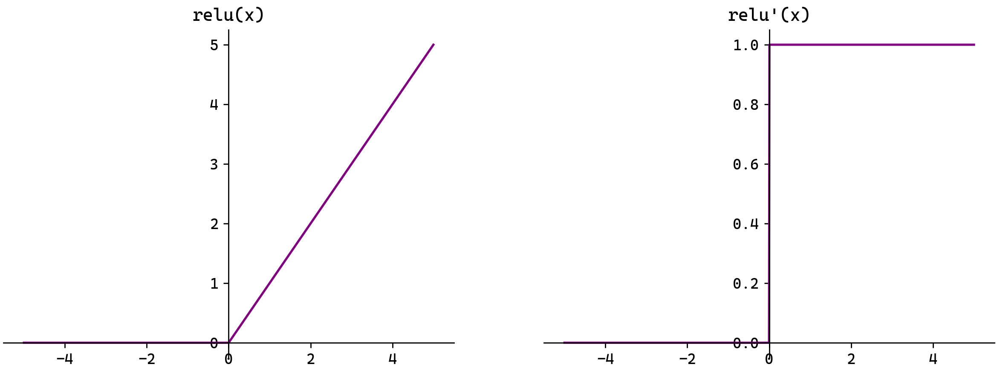

ReLU（Rectified Linear Unit，修正线性单元）会将小于0的输入转换为0，大于等于0的输入则保持不变。ReLU定义简单，计算量小。常用于隐藏层。

ReLU作为激活函数不存在梯度消失。当输入小于0时，ReLU的输出为0，这意味着在神经网络中，ReLU激活的节点只有部分是“活跃”的，这种稀疏性有助于减少计算量和提高模型的效率。

当神经元的输入持续为负数时，ReLU的输出始终为0。这意味着神经元可能永远不会被激活，从而导致“神经元死亡”问题。这会影响模型的学习能力，特别是如果大量的神经元都变成了“死神经元”。为解决此问题，可使用Leaky ReLU来代替ReLU作为激活函数。Leaky ReLU$\left( f\left( x \right)=\left( \begin{aligned} αx,x≤0 \\ x,x>0 \end{aligned} \right)，其中α是一个很小的常数 \right)$在负数区域引入一个小的斜率来解决“神经元死亡”问题。

### Softmax函数

$$
y_{k}=\frac{e^{x_{k}}}{\sum_{i=1}^{n} e^{x_{i}}},  k=1~n
$$

$$
\frac{∂y_{k}}{∂x_{i}}=\left( \begin{aligned} y_{k}\left( 1-y_{i} \right),k=i \\ -y_{k}y_{i},k≠i \end{aligned} \right)
$$

Softmax将一个任意的实数向量转换为一个概率分布，确保输出值的总和为1,是二分类激活函数Sigmoid在多分类上的推广。Softmax常用于多分类问题的输出层，用来表示类别的预测概率。

Softmax会放大输入中较大的值，使得最大输入值对应的输出概率较大，其他较小的值会被压缩。即在类别之间起到了一定的区分作用。

$$
\left( \begin{matrix} 1 \\ 3 \\ 5 \\ 10 \end{matrix} \right)Softmax\left( \begin{matrix} 0.00012246 \\ 0.00090485 \\ 0.006686 \\ 0.99229 \end{matrix} \right)
$$

PyTorch中提供了sotfmax函数和nn.Softmax类，调用时需要传入dim参数：

```python
y = torch.softmax(x, dim=1)
```

这里dim=1，表示在维度1方向进行softmax计算，得到的分类概率y在这个维度方向上和为1。

### 其他常见激活函数

#### Identity（恒等函数）

$$
f\left( x \right)=x，f^{'}\left( x \right)=1
$$

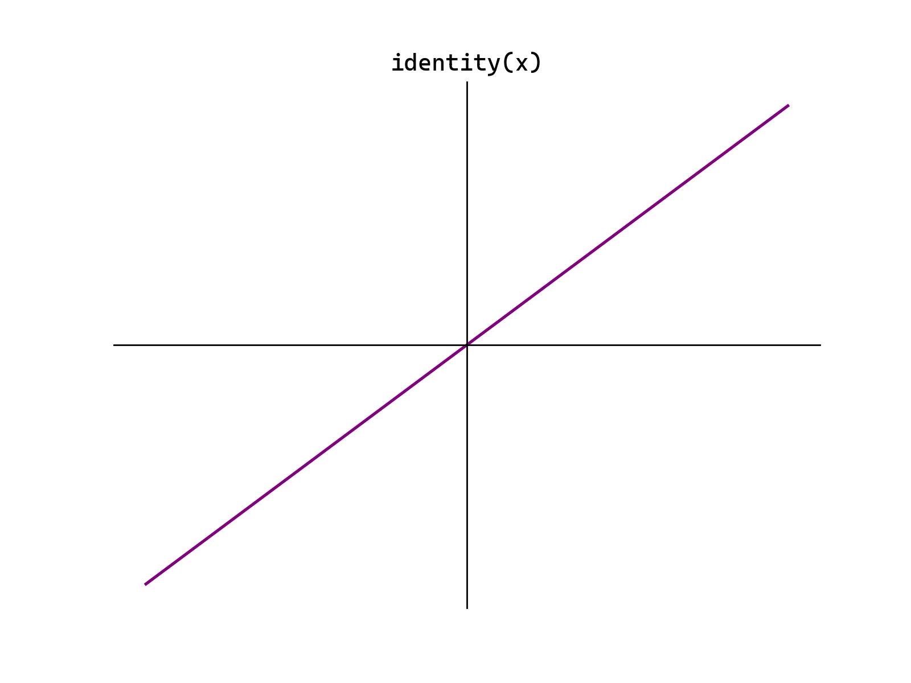

#### Leaky ReLU（Leaky Rectified Linear Unit）

$$
f\left( x \right)=\left( \begin{aligned} αx,x≤0 \\ x,x>0 \end{aligned} \right)，f^{'}\left( x \right)=\left( \begin{aligned} α,x≤0 \\ 1,x>0 \end{aligned} \right)
$$

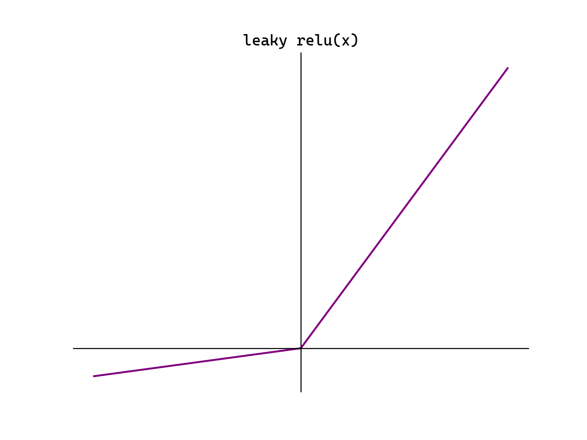

#### PReLU（Parametric Rectified Linear Unit）

$$
f\left( x \right)=\left( \begin{aligned} αx,x≤0 \\ x,x>0 \end{aligned} \right)，f^{'}\left( x \right)=\left( \begin{aligned} α,x≤0 \\ 1,x>0 \end{aligned} \right)
$$

这里$α$是一个可训练的参数，而非固定的常数。

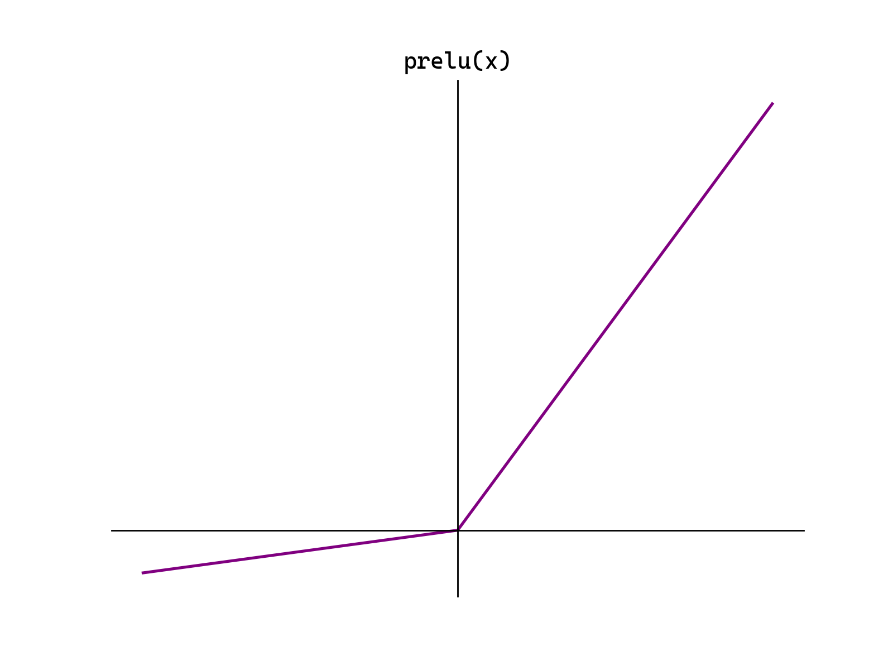

#### RReLU（Randomized Leaky ReLU）

$$
f\left( x \right)=\left( \begin{aligned} αx,x≤0 \\ x,x>0 \end{aligned} \right)，f^{'}\left( x \right)=\left( \begin{aligned} α,x≤0 \\ 1,x>0 \end{aligned} \right)
$$

这里$α$是一个在训练时从一个均匀分布中随机选择的参数。

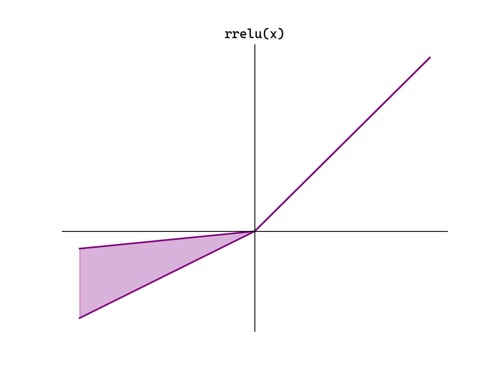

#### ELU（Exponential Linear Unit）

$$
f\left( x \right)=\left( \begin{aligned} α\left( e^{x}-1 \right),x≤0 \\ x,x>0 \end{aligned} \right)，f^{'}\left( x \right)=\left( \begin{aligned} αe^{x},x≤0 \\ 1,x>0 \end{aligned} \right)
$$

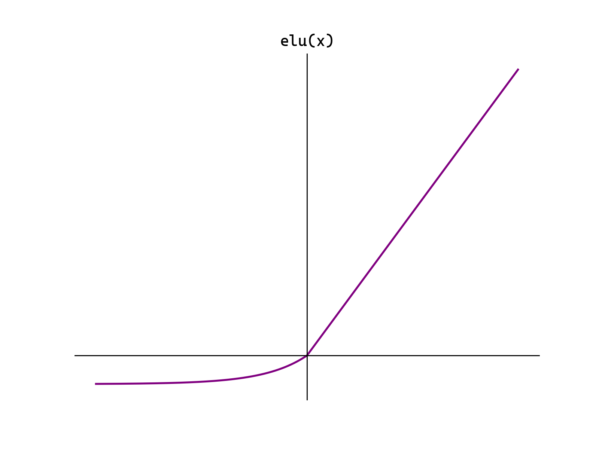

#### Swish（也称Sigmoid Linear Unit，SiLU）

$$
f\left( x \right)=\frac{x}{1+e^{-x}}，f^{'\left( x \right)}=\frac{1+e^{-x}+xe^{-x}}{{\left( 1+e^{-x} \right)}^{2}}
$$

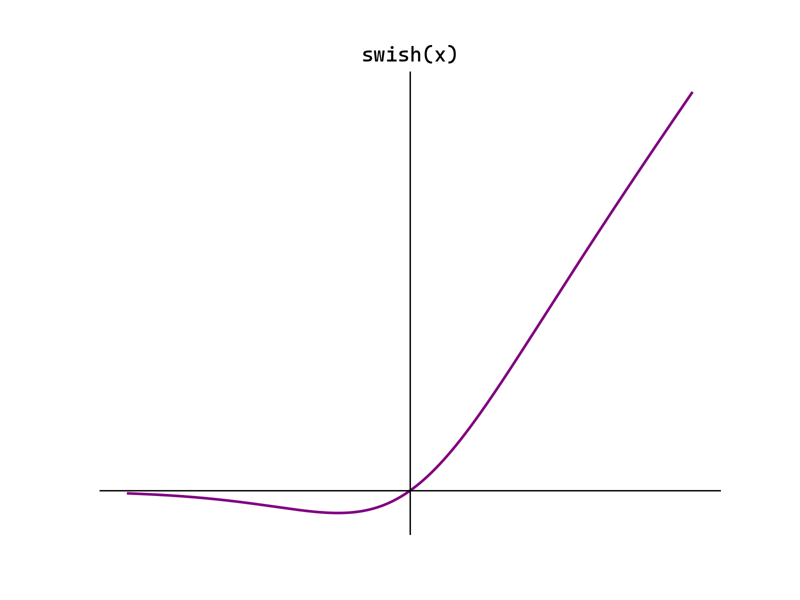

#### Softplus

$$
f\left( x \right)=\ln\left( 1+e^{x} \right)，f^{'\left( x \right)}=\frac{1}{1+e^{-x}}
$$


### 如何选择激活函数

#### 隐藏层

首选ReLU，如果效果不好可尝试Leaky ReLU等。

Sigmoid在隐藏层易导致梯度消失，应尽量避免。

Tanh的输出均值为0，对中心化数据更友好，但仍可能引发梯度消失，仅适用于浅层网络。

#### 输出层

二分类选择Sigmoid。

多分类选择Softmax。

回归默认选择Identity。

## 搭建神经网络

### 各层之间的信号传递

这里以一个三层神经网络为例，说明从输入到输出（前向传播）的处理计算。

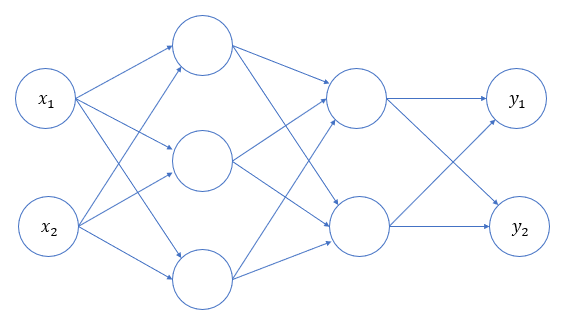

我们的输入层（第0层）有2个神经元；第1个隐藏层（第1层）有3个神经元；第2个隐藏层（第2层）有2个神经元；输出层（第3层）有2个神经元。

上面只是三层网络的示意图，实际上每层还应该有偏置，各输入信号加权总和还要经过激活函数的处理。接下来逐层进行分析，考察信号在各层之间传递的过程。

（1）输入层（第0层）→ 第1层

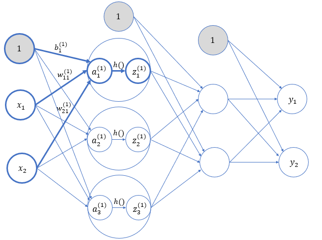

权重和神经元的上标（1）表示网络层号。而下标对于神经元来说，就是这一层内的“索引号”；对于权重来说则包含两个数字，分别代表前一层和后一层神经元的索引号。所以，$w_{21}^{(1)}$ 就表示这是第1层的权重（输入层到第1层），并且是从第2个输入节点到第1层第1个节点。偏置的下标只有1个，因为前一层的偏置节点只有一个。

对于第1个隐藏层的第1个神经元，全连接层的输出记作${ a}_{1}^{(1)}$，可以得到：

$a_{1}^{(1)}=w_{11}^{(1)}x_{1}+w_{21}^{(1)}x_{2}+ b_{1}^{(1)}$

$z_{1}^{(1)}=h(a_{1}^{(1)})$

同样，对于第1层的第2个、第3个神经元，有：

$a_{2}^{\left( 1 \right)}=w_{12}^{\left( 1 \right)}x_{1}+w_{22}^{\left( 1 \right)}x_{2}+ b_{2}^{\left( 1 \right)}$

$a_{3}^{(1)}=w_{13}^{(1)}x_{1}+w_{23}^{(1)}x_{2}+ b_{3}^{(1)}$

我们可以直接写成矩阵的形式：

$A^{(1)}=XW^{(1)}+B^{(1)}$

$Z^{(1)}=h(A^{(1)})$

其中，

$$
A^{\left( 1 \right)}=\left( a_{1}^{\left( 1 \right)}  a_{2}^{\left( 1 \right)}  a_{3}^{\left( 1 \right)} \right),  X=\left( x_{1}  x_{2} \right),  B^{\left( 1 \right)}=\left( b_{1}^{\left( 1 \right)}  b_{2}^{\left( 1 \right)}  b_{3}^{\left( 1 \right)} \right),
$$

$$
W^{(1)}=\left( \begin{matrix} w_{11}^{(1)} & w_{12}^{(1)} & w_{13}^{(1)} \\ w_{21}^{(1)} & w_{22}^{(1)} & w_{23}^{(1)} \end{matrix} \right),    Z^{\left( 1 \right)}=\left( z_{1}^{\left( 1 \right)}  z_{2}^{\left( 1 \right)}  z_{3}^{\left( 1 \right)} \right)
$$

由于有2个输入节点、3个第1层节点，所以全连接层的权重W就应该是一个2×3的矩阵。这样，我们就可以很容易地利用矩阵乘法计算出输出信号值了。

（2）第1层 → 第2层

第1层到第2层的处理类似，将前一层的输出z作为下一层的输入；权重参数应该是一个3×2的矩阵。

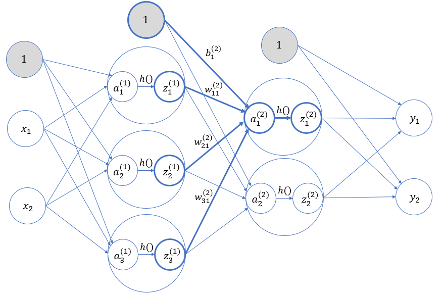

（3）第2层 → 输出层（第3层）

第2层到输出层的处理也类似，权重参数为2×2的矩阵；不过输出层的激活函数一般与隐藏层是不同的，这里用 $σ()$ 表示。

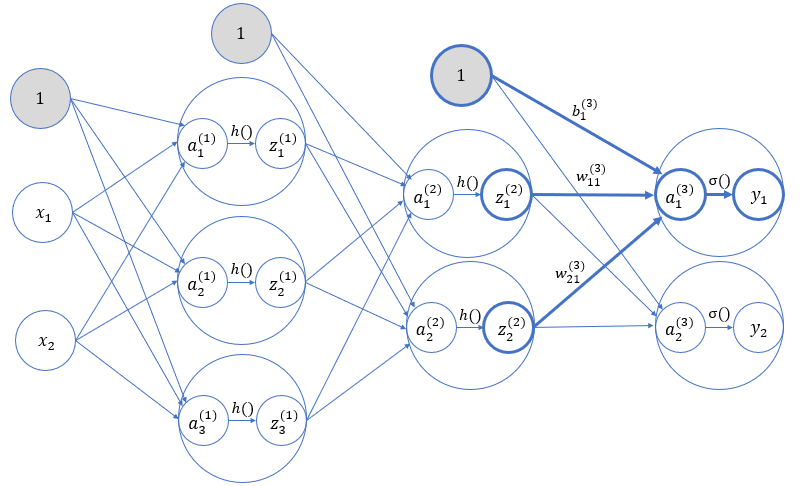

经过三层网络的逐层前向传播，最终得到了神经网络输出y。

### 自定义模型

在神经网络框架中，由多个层组成的组件称之为 模块（Module）。

在PyTorch中，Module类是所有神经网络的基类。模型就是一个Module，各网络层、模块也是Module。

在定义一个Module时，我们需要继承torch.nn.Module并主要实现两个方法：

- __init__：定义网络各层的结构，并初始化参数。
- forward：根据输入进行前向传播，并返回输出。计算其输出关于输入的梯度，可通过其反向传播函数进行访问（通常自动发生）。由于Module的__call__方法指向了forward方法，因此forward就是每次调用的具体实现。
接下来使用PyTorch实现下图的神经网络：

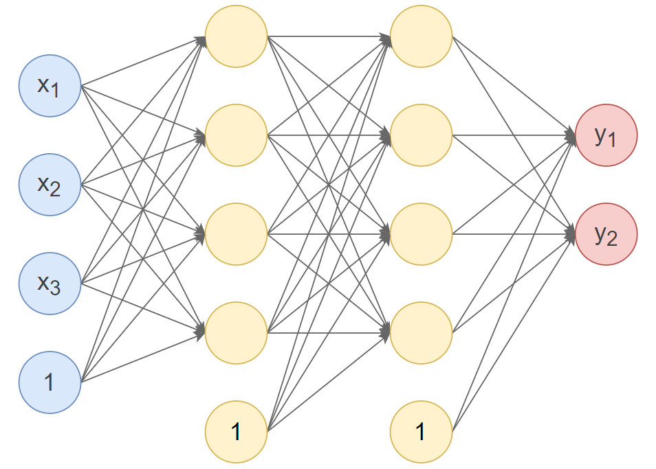

第1个隐藏层：激活函数使用Tanh。

第2个隐藏层：激活函数使用ReLU。

输出层：激活函数使用Softmax。

```python
import torch
import torch.nn as nn

class Model(nn.Module):
    # 初始化
    def __init__(self):
        super(Model, self).__init__()  # 调用父类初始化
        self.linear1 = nn.Linear(3, 4)  # 第1个隐藏层，3个输入，4个输出
        self.linear2 = nn.Linear(4, 4)  # 第2个隐藏层，4个输入，4个输出
        self.out = nn.Linear(4, 2)  # 输出层，4个输入，2个输出

    # 前向传播
    def forward(self, x):
        x = self.linear1(x)  # 经过第1个隐藏层
        x = torch.tanh(x)  # 激活函数
        x = self.linear2(x)  # 经过第2个隐藏层
        x = torch.relu(x)  # 激活函数
        x = self.out(x)  # 经过输出层
        x = torch.softmax(x, dim=1)  # 激活函数
        return x

model = Model()
output = model(torch.randn(10, 3))
print("输出：\n", output)
print()

# 使用named_parameters()查看各层参数
print("模型参数：")
for name, param in model.named_parameters():
    print(name, param)
    print()

# 使用state_dict()查看各层参数
print("模型参数：\n", model.state_dict())
```

### 查看模型结构和参数数量

可使用torchsummary.summary来查看模型结构与参数数量。需要先安装torchsummary库：pip install torchsummary。

```python
from torchsummary import summary

# input_size:特征数，batch_size:样本数
summary(model, input_size=(3,), batch_size=10, device="cpu")
```

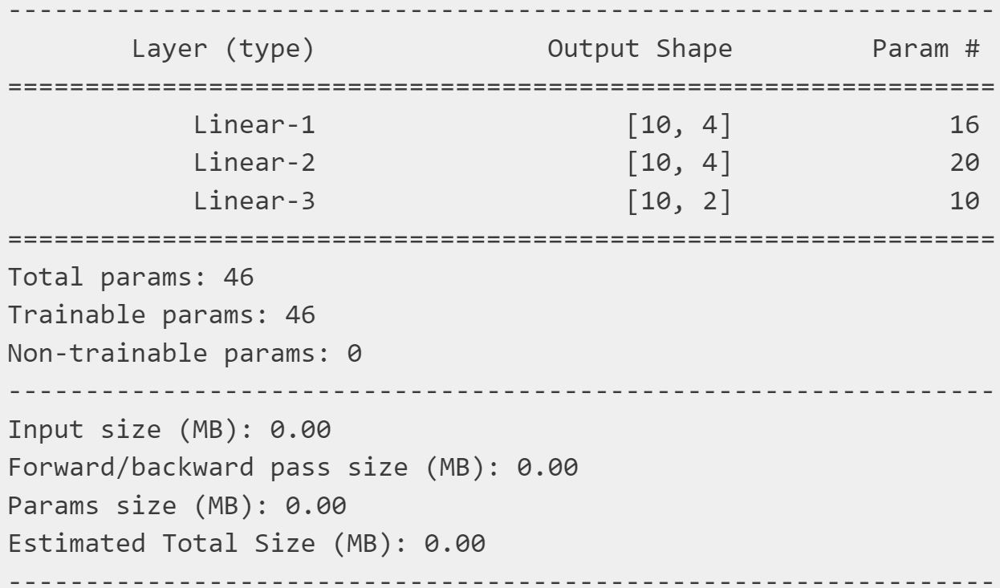

以第1个隐藏层为例：每个节点有3个权重与1个偏置，计4个参数，4个节点共计16个参数。

### 使用Sequential构建模型

可以通过torch.nn.Sequential来构建模型，将各层按顺序传入。

```python
# 构建模型
model = nn.Sequential(
    nn.Linear(3, 4),
    nn.Tanh(),
    nn.Linear(4, 4),
    nn.ReLU(),
    nn.Linear(4, 2),
    nn.Softmax(dim=1),
)

output = model(torch.randn(10, 3))
print("输出：\n", output)
```

Sequential类使模型构造变得简单，不必自定义类就可以组合新的架构。然而并不是所有的架构都是简单的顺序架构，当需要更强的灵活性时还是需要自定义模型。

## 加载神经网络模型

神经网络作为一个机器学习模型，主要的参数就是全连接层中的权重和偏置。通过输入数据进行训练，就可以得到最佳的模型参数，从而很好地进行预测。

如果我们已经训练好一个神经网络模型，也可以将它的参数保存到文件；这样，之后就可以从文件中快速加载参数、直接进行预测了。

PyTorch中提供了 torch.save() 和 torch.load() 方法，分别用于保存和加载模型参数。

```python
import torch
# 将模型参数（状态字典）保存到文件
torch.save(model.state_dict(), "model.pt")
# 从文件中读取模型参数，并加载到模型
state_dict = torch.load("model.pt")
model.load_state_dict(state_dict)
```

这里保存的模型参数，是状态字典的形式，因此加载时还需要调用load_state_dict() 方法。模型加载参数之后，可以直接输入新数据进行预测。

## 应用案例：手写数字识别

我们使用Digit Recognizer数据集来进行手写数字识别：https://www.kaggle.com/competitions/digit-recognizer。

文件train.csv中包含手绘数字（从0到9）的灰度图像，每张图像为28×28像素，共784像素。每个像素有一个0到255的值表示该像素的亮度。

文件第1列为标签，之后784列分别为784个像素的亮度值。

可以先创建一个文件load_data.py，定义一个读取数据的函数get_data()：

```python
import pandas as pd
import torch
from sklearn.model_selection import train_test_split     # 划分数据集
from sklearn.preprocessing import MinMaxScaler        # 归一化 Scaler

def get_data():
    # 1. 加载数据集
    data = pd.read_csv("../data/train.csv")
    # 2. 划分训练集和测试集
    X = data.drop("label", axis=1)  # 特征
    y = data["label"]  # 标签
    x_train, x_test, y_train, y_test = train_test_split(X, y, test_size=0.3, random_state=42)
    # 3. 特征转换：归一化
    scaler = MinMaxScaler()
    x_train = scaler.fit_transform(x_train)
    x_test = scaler.transform(x_test)
    # 4. 转成 tensor
    x_train = torch.tensor( x_train ).float()
    x_test = torch.tensor( x_test ).float()
    y_train = torch.tensor (y_train.values )
    y_test = torch.tensor( y_test.values )
    return x_train, x_test, y_train, y_test
```

我们的任务，就是要搭建一个神经网络，实现它的前向传播；也就是要根据输入的数据（28×28 = 784数据点表示的图像），推断出它到底是哪个数字，这个过程也被称为“推理”。

这里，我们构建的也是一个三层神经网络，输入层应该有784个神经元，输出层有10个神经元（表示0~9的分类结果）；中间设置2个隐藏层，第一个隐藏层有50个神经元，第二个隐藏层有100个神经元。这里的参数是需要 学习 得到的；我们假设已经学习完毕，直接从保存好的文件nn_example.pt中进行读取即可。

代码如下：

```python
import torch
from torch import nn
from load_data import get_data
# 1. 读入数据
x_train, x_test, y_train, y_test = get_data()
# 2. 创建模型
model = nn.Sequential(
    nn.Linear(784, 50),
    nn.ReLU(),
    nn.Linear(50, 100),
    nn.ReLU(),
    nn.Linear(100, 10),
)

# 3. 加载模型参数
state_dict = torch.load("../data/nn_example.pt")
model.load_state_dict(state_dict)

batch_size = 100    # 批数量
n = x_test.shape[0]     # 数据个数
accuracy_cnt = 0    # 累计准确数量
for i in range(0, n, batch_size):
    # 1. 取出当前批次的测试数据
    x_batch = x_test[ i : i+batch_size]
    y_batch = y_test[ i : i+batch_size]
    # 2. 前向传播
    y = model(x_batch)
    # 3.得到预测结果
    y_pred = torch.argmax( y, dim=1 )
    # 4. 计算准确数量
    accuracy_cnt += y_pred.eq(y_batch).sum().item()
# 打印准确率
print("Accuracy:" ,  accuracy_cnt / n )
```
