# 神经网络的学习

神经网络的主要特点，就是可以从数据中进行“学习”。这个学习的过程，就是让训练数据自动决定最优的权重参数。

神经网络（深度学习）也是机器学习的一种；跟传统机器学习方法相比，神经网络不需要人工设置特征量（如 SIFT、HOG等），这样就可以用同样的流程直接处理所有问题了。

## 损失函数

神经网络中，需要以某个指标为线索来寻找最优权重参数；这个指标就是 损失函数（loss function）。

### 常见损失函数

#### 均方误差（MSE）

均方误差（Mean Squared Error ，MSE）是回归任务中最常见的损失函数，也称L2 Loss：

$$
L=\frac{1}{n}\sum_{i=1}^{n} {\left( y_{i}-t_{i} \right)}^{2}
$$

其中，yi表示神经网络的输出，ti表示监督数据的标签（正确的解标签），n则是数据的“维度”。对于固定维度的网络，前面的系数n不重要，因此公式有时也可以写成：

$$
L=\frac{1}{2}\sum_{i=1}^{n} {\left( y_{i}-t_{i} \right)}^{2}
$$

L2 Loss对异常值敏感，遇到异常值时易发生梯度爆炸。

#### 交叉熵误差

交叉熵误差（Cross Entropy Error）则是分类任务中最常见的损失函数：

$$
L=-\frac{1}{n}\sum_{i=1}^{n} t_{i}logy_{i}
$$

其中，log表示自然对数，yi表示神经网络的输出，ti表示正确解标签；而且，ti中只有正确解标签对应的值为1，其它均为0（one-hot表示）。

### 分类任务损失函数

#### 二分类任务损失函数

二分类任务常用二元交叉熵损失函数（Binary Cross-Entropy Loss）。

$$
L=-\frac{1}{n}\sum_{i=1}^{n} \left( y_{i}log\hat{y_{i}}+\left( 1-y_{i} \right)log\left( 1-\hat{y_{i}} \right) \right)
$$

其中：

- $y_{i}$为真实值（通常为0或1）
- $\hat{y_{i}}$为预测值（表示样本$i$为1的概率）

在PyTorch中可使用torch.nn.BCELoss实现：

```python
import torch
import torch.nn as nn

# 真实值
target = torch.tensor([[1], [0], [0]], dtype=torch.float32)
# 预测值
input = torch.randn((3, 1))
prediction = torch.sigmoid(input)
# 实例化损失函数
loss = nn.BCELoss()
print(loss(prediction, target))
```

#### 多分类任务损失函数

多分类任务常用多类交叉熵损失函数（Categorical Cross-Entropy Loss）。它是对每个类别的预测概率与真实标签之间差异的加权平均。

$$
L=-\frac{1}{n}\sum_{i=1}^{n} \sum_{c=1}^{C} y_{i,c}log\hat{y_{i,c}}
$$

其中：

- C是类别数
- $y_{i,c}$为真实值（表示$y_{i}$是否为类别c，通常为0或1）
- $\hat{y_{i,c}}$为预测值（表示样本$i$为类别c的概率）

在PyTorch中可使用torch.nn.CrossEntropyLoss 实现：

```python
import torch
import torch.nn as nn

# 真实值为标签
target = torch.tensor([1, 0, 3, 2, 5, 4])  # 真实值
input = torch.randn((6, 8))  # 预测值
loss = nn.CrossEntropyLoss()  # 实例化损失函数
print(loss(input, target))

# 真实值为概率
target = torch.randn(6, 8).softmax(dim=1)  # 真实值
input = torch.randn((6, 8))  # 预测值
loss = nn.CrossEntropyLoss()  # 实例化损失函数
print(loss(input, target))
```

注意：调用torch.nn.CrossEntropyLoss相当于调用了torch.nn.LogSoftmax之后再调用torch.nn.NLLLoss。即使用CrossEntropyLoss时上一层的输出不需要Softmax激活函数，因为该损失函数内会自动处理。

### 回归任务损失函数

#### MAE

平均绝对误差（Mean Absolute Erro，MAE），也称L1 Loss：

$$
L=\frac{1}{n}\sum_{i=1}^{n} \left( y_{i}-\hat{y_{i}} \right)
$$

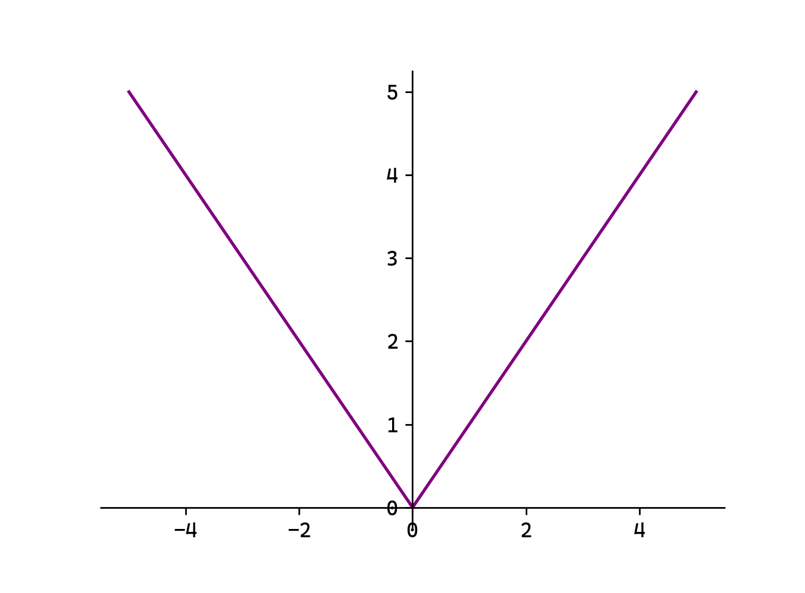

L1 Loss对异常值鲁棒，但在0点处不可导。

在PyTorch中，可使用torch.nn.L1Loss实现：

```python
import torch
import torch.nn as nn
# 定义数据
input = torch.randn(5)
target = torch.randn(5)
# 定义损失函数
loss_l1 = nn.L1Loss()
# 计算损失
loss = loss_l1(input, target)
print(loss)
```

#### MSE

均方误差（Mean Squared Error ，MSE），也称L2 Loss：

$$
L=\frac{1}{n}\sum_{i=1}^{n} {\left( y_{i}-\hat{y_{i}} \right)}^{2}
$$

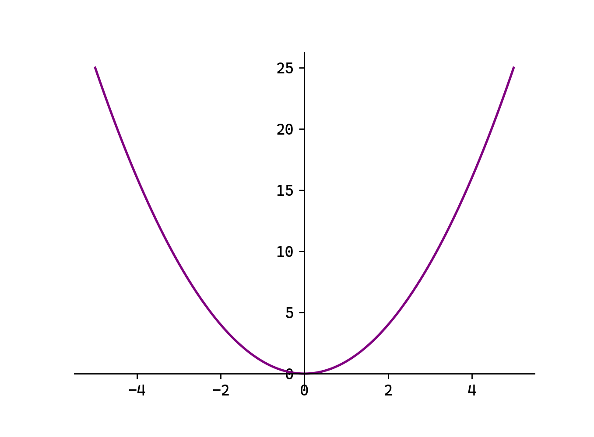

L2 Loss对异常值敏感，遇到异常值时易发生梯度爆炸。

在PyTorch中，可使用torch.nn.MSELoss实现：

```python
# 定义损失函数
loss_l2 = nn.MSELoss()
# 计算损失
loss = loss_l2(input, target)
print(loss)
```

#### Smooth L1

平滑L1：

$$
Smooth L1=\left( \begin{aligned} \frac{1}{2}{\left( y_{i}-\hat{y_{i}} \right)}^{2},\left( y_{i}-\hat{y_{i}} \right)<1 \\ \left( y_{i}-\hat{y_{i}} \right)-\frac{1}{2},\left( y_{i}-\hat{y_{i}} \right)≥1 \end{aligned} \right)
$$

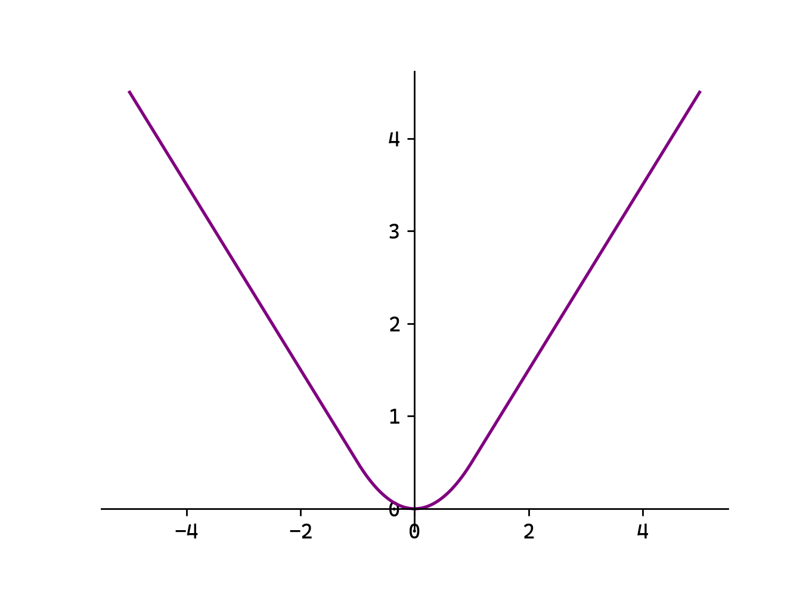

当误差较小时（$\left( y_{i}-\hat{y_{i}} \right)<1$）使用L2 Loss，使得损失函数平滑可导。当误差较大时（$\left( y_{i}-\hat{y_{i}} \right)≥1$）使用L1 Loss降低异常值的影响。

在PyTorch中，可使用torch.nn.SmoothL1Loss实现：

```python
# 定义损失函数
loss_smoothl1 = nn.SmoothL1Loss()
# 计算损失
loss = loss_smoothl1(input, target)
print(loss)
```

损失函数的值越小，代表我们选取的参数越适合。想要求得损失函数的最小值，最基本的想法就是对函数求导，解出导数值为0的点，并判断它是否为极小值/最小值；然而导数方程不易求解，我们通常会采用迭代优化算法来求取损失函数的极小值。

## 随机梯度下降法

### 梯度下降法

梯度下降法（Gradient Descent）是一种用于最小化目标函数的迭代优化算法。核心是沿着目标函数（如损失函数）的负梯度方向逐步调整参数，从而逼近函数的最小值。梯度方向指示了函数增长最快的方向，因此负梯度方向是函数下降最快的方向。

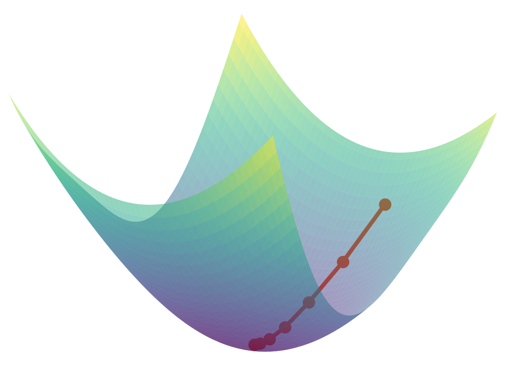

具体来说，我们初始找到函数f(x1,x2)的一个点(x1,x2)，在该处的梯度为：

$$
∇f\left( x1,x2 \right)=\left(   \frac{∂f}{∂x_{1}}    \frac{∂f}{∂x_{2}}  \right)
$$

则可以按下式进行更新：

$$
x_{1}^{'}=x_{1}-η\frac{∂f}{∂x_{1}}
$$

$$
x_{2}^{'}=x_{2}-η\frac{∂f}{∂x_{2}}
$$

这样就可以沿着负梯度方向，找到一个新的点${ (x}_{1}^{'}, x_{2}^{'})$，让函数值更小。

这里的η表示每次的更新量，在神经网络的学习过程中，就代表了一次学习的步长（一次学习多少、多大程度去更新参数），称为 学习率（learning rate）。学习率需要预先设定好，过大或过小都会导致学习效果不佳。

### 模型训练相关概念

#### Epoch

1个Epoch表示模型完整遍历一次整个训练数据集的过程。例如，训练10个Epoch表示模型将整个数据集反复学习10次。

模型需要多次遍历数据集（多个Epoch）才能逐步学习数据中的模式，单次遍历数据集（1个Epoch）通常不足以让模型收敛，多次遍历可以逐步优化模型参数。

#### Batch Size

Batch Size是每次训练时输入的样本数量。例如，Batch Size=32 表示每次用32个样本计算一次梯度并更新模型参数。

小批量数据计算梯度比单样本（Batch Size=1）更稳定，比全批量（Batch Size=全体数据）更高效。并且较小的Batch Size可能带来更多噪声，有助于模型泛化。

#### Iteration

一次Iteration表示完成一个Batch数据的正向传播（预测）和反向传播（更新参数）的过程。

例如，数据集现有2000个样本，对其训练10个Epoch，选择Batch Size=64：

Batch个数为2000//64+1=31+1=32个（最后一个Batch仅有16个样本）。

每个Epoch中迭代次数Itreation=32次。

总迭代次数为10×32=320次。

总训练样本数为10×2000=20000。

### SGD

在神经网络的学习过程中，可以使用梯度下降法来更新参数，目标就是减小损失函数的值。

实际操作时，一般会从训练数据中随机选择一个小批量数据（mini-batch），然后用梯度下降法迭代多个轮次（iteration）；这种“对随机选择的数据进行的梯度下降法”，被称作 随机梯度下降法（stochastic gradient descent，SGD）。

具体过程如下：

#### 1）随机选择批数据（mini-batch）

从训练数据中随机选出一部分数据，学习的目标就是要减少这个mini-batch数据的损失函数值。

2）计算梯度

对当前的各权重参数，计算出梯度的值，负梯度就表示了损失函数减小最多的方向。

3）更新参数

按照4.2.1节中梯度下降法的公式，对权重参数沿负梯度方向进行微小更新。

4）重复迭代

重复上面的步骤1）2）3），直到完成预定的总迭代次数。

### API调用

在PyTorch中，SGD由torch.optim.SGD类实现，需要传入模型参数，以及超参数，如学习率lr：

```python
# 定义SGD优化器
optimizer = optim.SGD(model.parameters(), lr=1e-3)
```

在随机选取批量数据、计算出参数梯度后，可以直接调优化器的step()方法，对参数进行更新，完成一次迭代过程：

```python
# 更新参数
optimizer.step()
```

## 数据集的创建和分批

### 数据集DataSet

在PyTorch中，可以通过继承抽象类DataSet实现自定义的数据集，核心是实现__len__和__getitem__方法。

```python
from torch.utils.data import Dataset
class SimpleDataset(Dataset):
    # 初始化
    def __init__(self, data):
        self.data = data
    # 返回数据集大小
    def __len__(self):
        return len(self.data)
    # 按索引号，获取数据样本
    def __getitem__(self, index):
        sample = self.data[index]
        return sample      # 返回单个样本
# 创建简单数据集
data = [1, 2, 3, 4, 5]
dataset = SimpleDataset(data)
print(dataset[0])
```

由于PyTorch中的神经网络运算都是基于Tensor的，因此更常见的是直接基于Tensor创建的数据集TensorDataset：

```python
from torch.utils.data import TensorDataset
tensor = torch.randn(2, 3)
print(tensor)
# 构建数据集
dataset = TensorDataset(tensor)
print(dataset[1])
```

### 数据加载器DataLoader

随机梯度下降的第一步，就是要从训练集中随机选取一批数据。这可以通过DataSet配合使用数据加载器类DataLoader来实现。

DataLoader可以将自定义的 Dataset 封装成可迭代的批次（batches），并支持批量处理、数据洗牌等功能，是训练神经网络的基础。‌

```python
import torch
from torch.utils.data import TensorDataset, DataLoader
# 定义数据
X = torch.randn(10, 3)
y = torch.randn( 10 )
# 定义数据集
dataset = TensorDataset(X, y)
# 创建数据加载器
dataloader = DataLoader(dataset=dataset, batch_size=2, shuffle=True)
for x_batch, y_batch in dataloader:
    print(x_batch)
    print(y_batch)
    print()
```

## 反向传播算法

反向传播（Backward Propagation或Back Propagation，BP算法）指的是计算神经网络参数梯度的方法。简言之，该方法根据微积分中的链式法则，按相反的顺序从输出层到输入层遍历网络。该算法存储了计算某些参数梯度时所需的任何中间变量。

### 计算图

计算图将计算过程用图表示出来。这里说的图是数据结构中的图，通过多个节点和边表示（连接节点的直线称为边）。

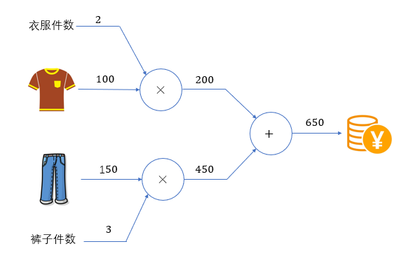

如上就是 $100×2+150×3=650$的计算图表示。

计算图的基本计算原则，就是从输入出发、按照箭头方向，从左到右依次进行计算，最终得到输出结果。这个过程，其实就是 前向传播（forward）。

计算图的特点是可以通过传递“局部计算”获得最终结果。即只需根据与自己相关的信息输出接下来的结果。无论全局的计算有多么复杂，各个节点所要做的就是进行局部计算并传递计算结果，最终得出全局的复杂计算的结果。

如果增加更多的计算环节，比如再乘以一个“零售加价系数”，计算图如下所示。

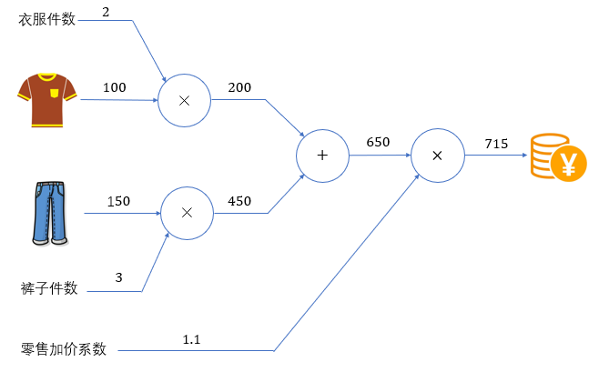

如果我们进一步考虑，当衣服的价格上涨（输入变化）时，会多大程度上影响最后要支付的金额（输出结果）？

将输入的衣服价格记为x，输出的支付金额记为L，这其实就是要求导数值 $\frac{∂L}{∂x}$。在计算图上，我们可以利用反向（从右到左）的传递来方便地计算导数。这个过程，就可以叫做 反向传播（backward）。

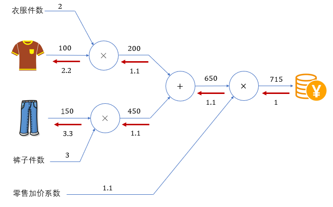

### 链式法则

反向传播将局部导数向反方向传递，传递的原理基于链式法则。反向传播时将信号乘以节点的局部导数然后传递给下一个节点。

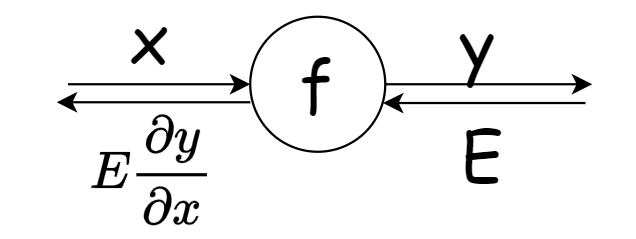

对于复合函数$z={\left( x+y \right)}^{2}$，令$u=x+y$，则

$$
\frac{∂z}{∂x}=\frac{∂z}{∂u}\frac{∂u}{∂x}=2u×1=2\left( x+y \right)
$$

现用计算图表示：

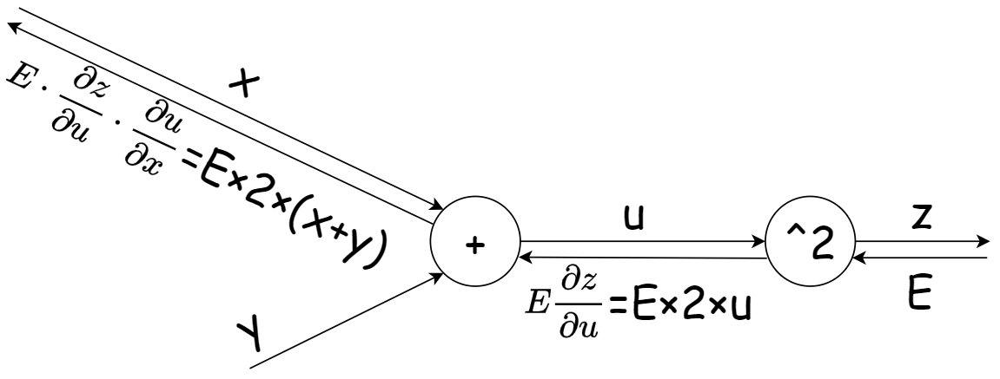

利用计算图的反向传播，可以很容易地计算出输出关于输入的偏导数。

### 加法节点的反向传播

对于$z=x+y$，$\frac{∂z}{∂x}=1$，$\frac{∂z}{∂y}=1$。因此加法的反向传播会将上游传来的值原样向下游传递。

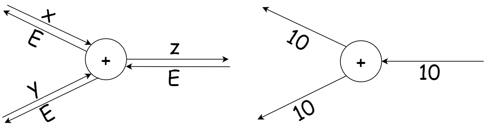

### 乘法节点的反向传播

对于$z=xy$，$\frac{∂z}{∂x}=y$，$\frac{∂z}{∂y}=x$。因此乘法的反向传播会将上游传来的值乘以输入的翻转向下游传递。

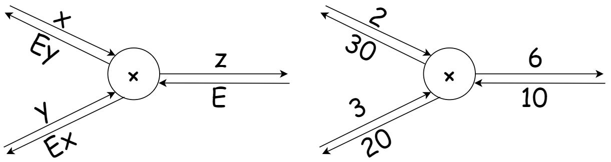

## 神经网络的反向传播

现在将计算图应用到神经网络中。神经网络中最重要的计算操作就是全连接层和激活函数，下面就就分别来讨论各种激活函数以及全连接层的反向传播。

### ReLU的反向传播

对于ReLU函数：

$$
f\left( x \right)=\max\left( 0,x \right)= \left( \begin{aligned} 0,x≤0 \\ x,x>0 \end{aligned} \right)
$$

其导数为：

$$
f^{'\left( x \right)}=\left( \begin{aligned} 0,x≤0 \\ 1,x>0 \end{aligned} \right)
$$

分为 $x≤0$ 和 $x>0$ 两种情况分别讨论，反向传播的计算图如下：

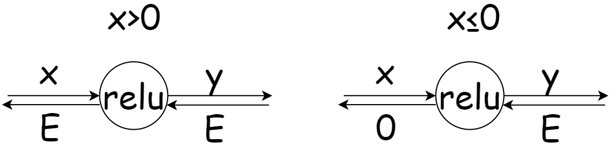

### Sigmoid的反向传播

对于Sigmoid函数：

$$
f\left( x \right)=\frac{1}{1+e^{-x}}
$$

其导数为：

$$
f^{'}\left( x \right)=-{\left( \frac{1}{1+e^{-x}} \right)}^{2}·e^{-x}·\left( -1 \right)=\frac{e^{-x}}{{\left( {1+e}^{-x} \right)}^{2}}
$$

$$
=\frac{1}{1+e^{-x}}\left( 1-\frac{1}{1+e^{-x}} \right)
$$

$$
=f\left( x \right)\left( 1-f\left( x \right) \right)
$$

利用计算图的反向传播，也可以得到相同的结果：

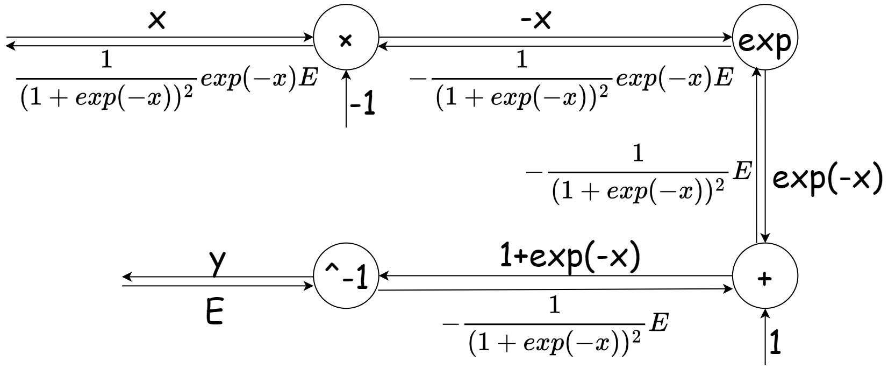

简化得：

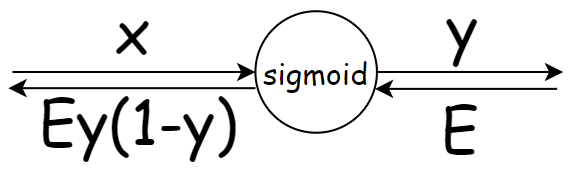

### 全连接层的反向传播和实现

在全连接层（Fully Connected Layer，Dense Layer）中，每个输入节点与输出节点相连，通过权重矩阵和偏置进行线性变换， 考虑N个数据一起进行正向传播的情况，写成矩阵计算形式：

$$
Y=XW+B
$$

这里的X是形状为N×m的矩阵，m就是输入神经元的个数；而W是形状为m×n的权重矩阵，n就是输出神经元的个数。

根据矩阵求导的运算法则，可以得到损失函数L关于X、W的偏导数：

$$
\frac{∂L}{∂X}=\frac{∂L}{∂Y} · W^{T}
$$

$$
\frac{∂L}{∂W}=X^{T}· \frac{∂L}{∂Y}
$$

用计算图的反向传播计算如下：

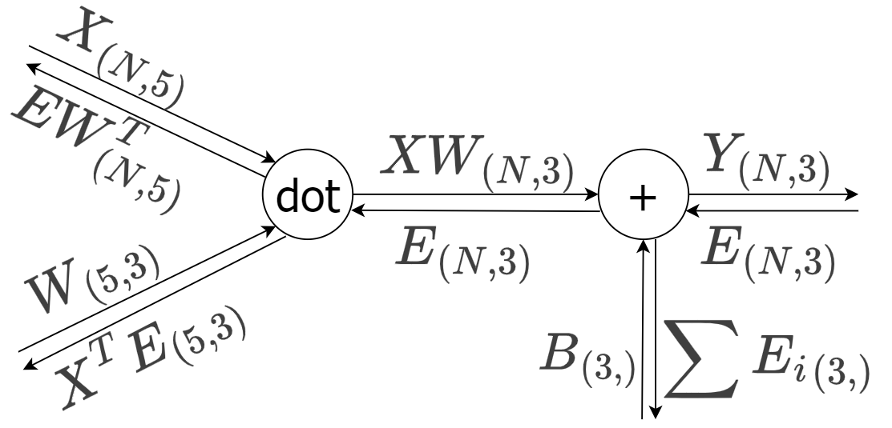

这里令 $E=\frac{∂L}{∂Y}$，需要注意矩阵的形状要满足矩阵乘法的要求。

### 输出层的反向传播和实现

在输出层，我们一般使用Softmax作为激活函数。

对于Softmax函数：

$$
y_{k}=\frac{e^{x_{k}}}{\sum_{i=1}^{n} e^{x_{i}}},  k=1~n
$$

其偏导数为：

$$
\frac{∂y_{k}}{∂x_{i}}=\left( \begin{aligned} y_{k}\left( 1-y_{i} \right),k=i \\ -y_{k}y_{i},k≠i \end{aligned} \right)
$$

而对于输出层，一般会直接将结果代入损失函数的计算。对于我们之前介绍的分类问题，这里选择交叉熵误差（Cross Entropy Error）作为损失函数，就可以得到一个Softmax-with-Loss层，它包含了Softmax和Cross Entropy Loss两部分。

导数的计算会比较复杂，可以用计算图表示如下：

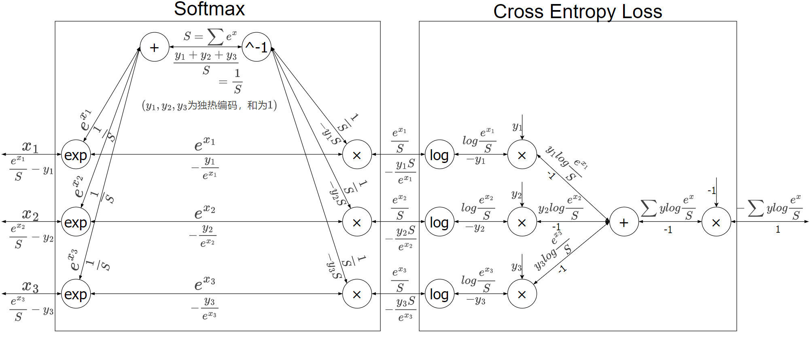

简化得：

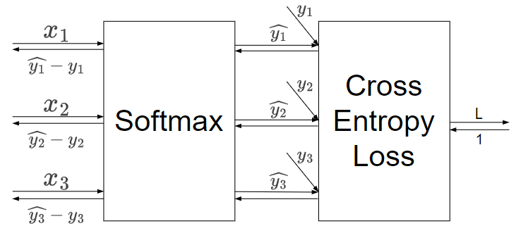

## PyTorch的自动微分模块

训练神经网络时，PyTorch框架会根据设计好的模型构建一个计算图（computational graph），来跟踪计算是哪些数据通过哪些操作组合起来产生输出，并通过反向传播算法来根据给定参数的损失函数的梯度调整参数（模型权重）。

### 计算图的梯度计算

PyTorch具有一个内置的微分引擎torch.autograd以支持计算图的梯度自动计算。

考虑最简单的单层神经网络，具有输入x、参数w、偏置b以及损失函数：

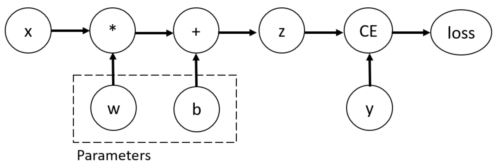

```python
import torch
# 输入x
x = torch.tensor(10.0)
# 目标值y
y = torch.tensor(3.0)
# 初始化权重w
w = torch.rand(1, 1, requires_grad=True)
# 初始化偏置b
b = torch.rand(1, 1, requires_grad=True)
z = w * x + b
# 设置损失函数
loss = torch.nn.MSELoss()
loss_value = loss(z, y)
# 反向传播
loss_value.backward()
# 打印w,b的梯度
print("w的梯度:\n", w.grad)
print("b的梯度:\n", b.grad)
```

该计算图中x、w、b为叶子节点，即最基础的节点。叶子节点的数据并非由计算生成，因此是整个计算图的基石，叶子节点张量不可以执行in-place操作。而最终的loss为根节点。

可通过is_leaf属性查看张量是否为叶子节点：

```python
print(x.is_leaf)  # True
print(w.is_leaf)  # True
print(b.is_leaf)  # True
print(z.is_leaf)  # False
print(y.is_leaf)  # True
print(loss_value.is_leaf)  # False
```

自动微分的关键就是记录节点的数据与运算。数据记录在张量的data属性中，计算记录在张量的grad_fn属性中。

计算图根据搭建方式可分为静态图和动态图，PyTorch是动态图机制，在计算的过程中逐步搭建计算图，同时对每个Tensor都存储grad_fn供自动微分使用。

若设置张量参数requires_grad=True，则PyTorch会追踪所有基于该张量的操作，并在反向传播时计算其梯度。依赖于叶子节点的节点，requires_grad默认为True。当计算到根节点后，在根节点调用backward()方法即可反向传播计算计算图中所有节点的梯度。

非叶子节点的梯度在反向传播之后会被释放掉（除非设置参数retain_grad=True）。而叶子节点的梯度在反向传播之后会保留（累积）。通常需要使用optimizer.zero_grad()清零参数的梯度。

### 训练神经网络

训练神经网络时，首先应该进行前向传播、计算损失值，从而构建出计算图；进而利用反向传播自动计算梯度，再使用优化器（如SGD）更新参数。

神经网络中的一次训练迭代代码如下：

```python
import torch
from torch import nn, optim

class Model(nn.Module):
    # 初始化
    def __init__(self):
        # 调用父类初始化
        super(Model, self).__init__()
        # 全连接层
        self.linear1 = nn.Linear(5, 3)
        # 初始化权重
        self.linear1.weight.data = torch.tensor(
            [
                [0.1, 0.2, 0.3],
                [0.4, 0.5, 0.6],
                [0.7, 0.8, 0.9],
                [0.10, 1.1, 1.2],
                [1.3, 1.4, 1.5],
            ]
        ).T
        # 初始化偏置
        self.linear1.bias.data = torch.tensor([1.0, 2.0, 3.0])

    # 前向传播
    def forward(self, x):
        x = self.linear1(x)
        return x

# 实例化模型
model = Model()
# 输入值
X = torch.tensor([[1, 2, 3, 4, 5], [6, 7, 8, 9, 10]], dtype=torch.float)
# 目标值
target = torch.tensor([[0, 0, 0], [0, 0, 0]], dtype=torch.float)
# 计算出输出值
output = model(X)
# 损失函数
loss = nn.MSELoss()
# 反向传播
loss(output, target).backward()
# 优化器
optimizer = optim.SGD(model.parameters(), lr=1)
# 更新参数
optimizer.step()
# 清空梯度
optimizer.zero_grad()
# 打印参数
for i in model.state_dict():
    print(i)
    print(model.state_dict()[i])
print()
```

### 从计算图中分离张量

有时我们希望将某些计算移动到计算图之外，可以使用Tensor.detach()返回一个新的变量，该变量与原变量具有相同的值，但丢失计算图中如何计算原变量的信息。换句话说，梯度不会在该变量处继续向下传播。例如：

```python
import torch

x = torch.ones(2, 2, requires_grad=True)
y = x * x
# 分离y来返回一个新变量u
u = y.detach()
z = u * x
# 梯度不会向后流经u到x
z.sum().backward()
# 反向传播函数计算z=u*x关于x的偏导数时将u作为常数处理，而不是z=x*x*x关于x的偏导数
x.grad == u
# tensor([[True, True],
#         [True, True]])
```

## 应用案例

### 机器学习案例：线性回归

在此虚拟环境中没有matplotlib，先安装：pip install matplotlib==3.9。

通过PyTorch训练一个模型一般分为以下4个步骤：

准备数据 → 构建模型 → 定义损失函数与优化器 → 模型训练

接下来，构建数据集并使用PyTorch实现线性回归：

```python
import torch
import matplotlib.pyplot as plt
from torch import nn, optim  # 模型、损失函数和优化器
from torch.utils.data import TensorDataset, DataLoader  # 数据集和数据加载器

# 构建数据集
X = torch.randn(100, 1)  # 输入
w = torch.tensor([2.5])  # 权重
b = torch.tensor([5.2])  # 偏置
noise = torch.randn(100, 1) * 0.1  # 噪声
y = w * X + b + noise  # 目标
dataset = TensorDataset(X, y)  # 构造数据集对象
dataloader = DataLoader(
    dataset, batch_size=10, shuffle=True
)  # 构造数据加载器对象，batch_size为每次训练的样本数，shuffle为是否打乱数据

# 构造模型
model = nn.Linear(in_features=1, out_features=1)  # 线性回归模型，1个输入，1个输出

# 损失函数和优化器
loss = nn.MSELoss()  # 均方误差损失函数
optimizer = optim.SGD(model.parameters(), lr=1e-3)  # 随机梯度下降，学习率0.001

# 模型训练
loss_list = []
for epoch in range(1000):
    total_loss = 0
    train_num = 0
    for x_train, y_train in dataloader:
        # 每次训练一个batch大小的数据
        y_pred = model(x_train)  # 模型预测
        loss_value = loss(y_pred, y_train)  # 计算损失
        optimizer.zero_grad()  # 梯度清零
        loss_value.backward()  # 反向传播
        optimizer.step()  # 更新参数
        total_loss += loss_value.item()
        train_num += len(y_train)
    loss_list.append(total_loss / train_num)

print(model.weight, model.bias)  # 打印权重和偏置
plt.plot(loss_list)
plt.xlabel("epoch")
plt.ylabel("loss")
plt.show()
```

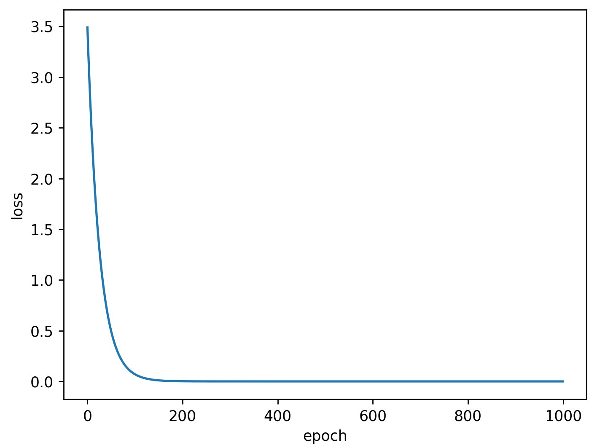

### 深度学习案例：手写数字识别

我们回顾一下3.6节曾实现的手写数字识别案例：

文件train.csv中包含手绘数字（从0到9）的灰度图像，每张图像为28×28像素，共784像素。每个像素有一个0到255的值表示该像素的亮度。

文件第1列为标签，之后784列分别为784个像素的亮度值。

我们搭建了一个三层神经网络，输入层有784个神经元，输出层有10个神经元（表示0~9的分类结果）；中间设置2个隐藏层，第一个隐藏层有50个神经元，第二个隐藏层有100个神经元。

之前假设已经学习完毕，直接从保存好的文件nn_exampl.pt中加载模型参数；现在，我们将会对这个模型进行完整的训练和验证。

数据的加载依然不变，可以直接调用get_data() 函数。其它代码实现如下：

```python
import torch
from torch import nn, optim, device
from torch.utils.data import TensorDataset, DataLoader
from load_data import get_data

# 1. 读入数据（训练集和验证集）
x_train, x_val, t_train, t_val = get_data()
# 2. 创建模型
model = nn.Sequential(
    nn.Linear(784, 50),
    nn.ReLU(),
    nn.Linear(50, 100),
    nn.ReLU(),
    nn.Linear(100, 10),
)
# 3. 设置超参数
lr = 0.1
batch_size = 64
epochs = 20
# 4. 构建 DataSet 和 DataLoader
train_dataset = TensorDataset(x_train, t_train)
val_dataset = TensorDataset(x_val, t_val)
train_loader = DataLoader(train_dataset, batch_size=batch_size, shuffle=True)
val_loader = DataLoader(val_dataset, batch_size=batch_size)
# 5. 定义损失函数和优化器
loss_fn = nn.CrossEntropyLoss()
optimizer = optim.SGD(model.parameters(), lr=lr)
# 6. 定义设备
device = device('cuda' if torch.cuda.is_available() else 'cpu')
model.to(device)

# 7. 模型训练和验证
for epoch in range(epochs):
    # 7.1 训练
    model.train()
    train_loss_total = 0
    train_acc_cnt = 0
    for i, (input, target) in enumerate(train_loader):
        input, target = input.to(device), target.to(device)
        output = model(input)
        loss = loss_fn(output, target)
        loss.backward()
        optimizer.step()
        optimizer.zero_grad()
        # 累加损失
        train_loss_total += loss.item() * input.shape[0]
        # 记录准确个数
        y_pred = output.argmax(dim=1)
        train_acc_cnt += y_pred.eq(target).sum().item()
        # 打印进度条
        print(f"\r epoch:{epoch:0>2}[{'='*(int((i+1) / len(train_loader) * 50)):<50}]", end="")
    # 计算平均损失和准确率
    this_train_loss = train_loss_total / len(train_dataset)
this_train_acc = train_acc_cnt / len(train_dataset)
    # 7.2  验证
    model.eval()
    val_loss_total = 0
    val_acc_cnt = 0
    with torch.no_grad():
        for input, target in val_loader:
            input, target = input.to(device), target.to(device)
            # 前向传播
            output = model(input)
            # 计算损失
            loss = loss_fn(output, target)
            # 叠加损失
            val_loss_total += loss.item() * input.shape[0]
            # 记录准确数
            y_pred = output.argmax(dim=1)
            val_acc_cnt += y_pred.eq(target).sum().item()
    # 计算平均损失和准确率
    this_val_loss = val_loss_total / len(val_dataset)
    this_val_acc = val_acc_cnt / len(val_dataset)
    # 每轮打印输出一次
    print(f"train loss:{this_train_loss:.6f}, train acc:{this_train_acc:.6f}, val loss:{this_val_loss:.6f}, val acc:{this_val_acc:.6f}")
```
