# 学习的技巧

## 深度神经网络及其问题

### 深度学习

当神经网络的层数加深时，往往可以有效地提高识别精度；特别是对于大规模的复杂问题，通常都需要用更多的层来分层次传递信息，而且可以有效减少网络的参数数量，从而使得学习更加高效。使用深度神经网络进行的学习就被称为 深度学习（Deep Learning）。

ILSVRC是近年来机器视觉领域最受追捧且最具权威的学术竞赛之一，代表了图像领域的最高水平。它包含多个测试项目，其中最有名的就是“类别分类”（Classification），该项目会进行 1000 个类别的分类，比试识别精度。自从 2012 年以后的 ILSVRC 比赛，优胜队伍采用的方法基本上都是以深度学习为基础的。

可以说，深度学习代表了目前人工智能领域的发展方向，正以超乎想象的速度发展并改变我们的生活。

### 梯度消失和梯度爆炸

在某些神经网络中，随着网络深度的增加，梯度在隐藏层反向传播时倾向于变小。这就意味着，前面隐藏层中的神经元要比后面的学习起来更慢。这种现象被称为“梯度消失”。

与之对应，如果我们进行一些特殊的调整（比如初始权重很大），可以让梯度反向传播时不会明显减小，从而解决梯度消失的问题；然而这样一来，前面层的梯度又会变得非常大，引起网络不稳定，无法再从训练数据中学习。这种现象被称为“梯度爆炸”。

基于梯度学习的深度神经网络中，梯度本身是不稳定的，前面层中的梯度可能“消失”，也可能“爆炸”。

对于梯度消失和梯度爆炸，一个容易理解的解释是：当反向传播进行很多层的时候，每一层都对前一层梯度乘以了一个系数；因此当这个系数比较小（小于1）时，越往前传递，梯度就会越小、训练越慢，导致梯度消失；而如果这个系数比较大，则越往前传递梯度就会越大，导致梯度爆炸。

所以，深度神经网络的训练是比较复杂的，会有一系列的问题。研究表明，激活函数的选择、权重的初始化，甚至学习算法的实现方式都是影响因素；另外，网络的架构和其它一些超参数也有重要影响。

为了让深度神经网络的学习更加稳定、高效，我们需要考虑进一步改进寻找最优参数的方法，以及如何设置参数初始值、如何设定超参数；此外还应该解决过拟合的问题。

## 更新参数方法的优化

对于深度神经网络的学习，之前更新参数的方法是随机梯度下降法（SGD）。这种方法比较简单，也非常经典，但在很多具体问题中并不是最高效的。

### SGD的缺点

SGD的更新方式可以写为：

$$
W←W-η\frac{∂L}{∂W}
$$

这里W是要更新的权重参数（矩阵），损失函数L关于W的梯度就是 $\frac{∂L}{∂W}$ ；而η表示 学习率。

SGD有以下问题：

局部最优解：陷入局部最优，尤其在非凸函数中，难以找到全局最优解。

鞍点：陷入鞍点，梯度为0，导致训练停滞。

收敛速度慢：高维或非凸函数中，收敛速度较慢。

学习率选择：学习率过大导致震荡或不收敛，过小则收敛速度慢。

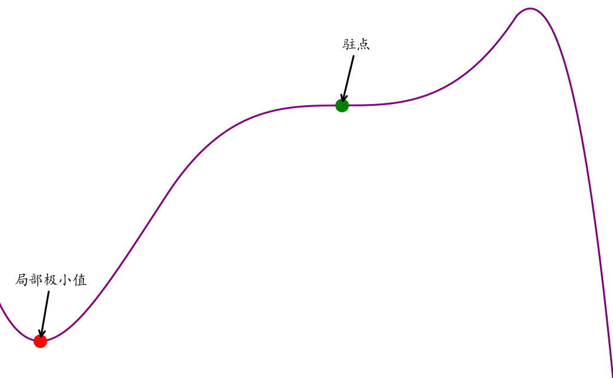

### Momentum

原始的梯度下降法直接使用当前梯度来更新参数：

$$
W←W-η∇
$$

而Momentum（动量法）会保存历史梯度并给予一定的权重，使其也参与到参数更新中：

$$
v←αv-η∇
$$

$$
W←W+v
$$

- $v$：历史（负）梯度的加权和
- $α$：历史梯度的权重
- $∇$：当前梯度，即$\frac{∂L}{∂W}$
- $η$：学习率

动量法有时能够减缓优化过程中的震荡，加快优化的速度。因为其会累计历史梯度，也可以有效避免鞍点问题。

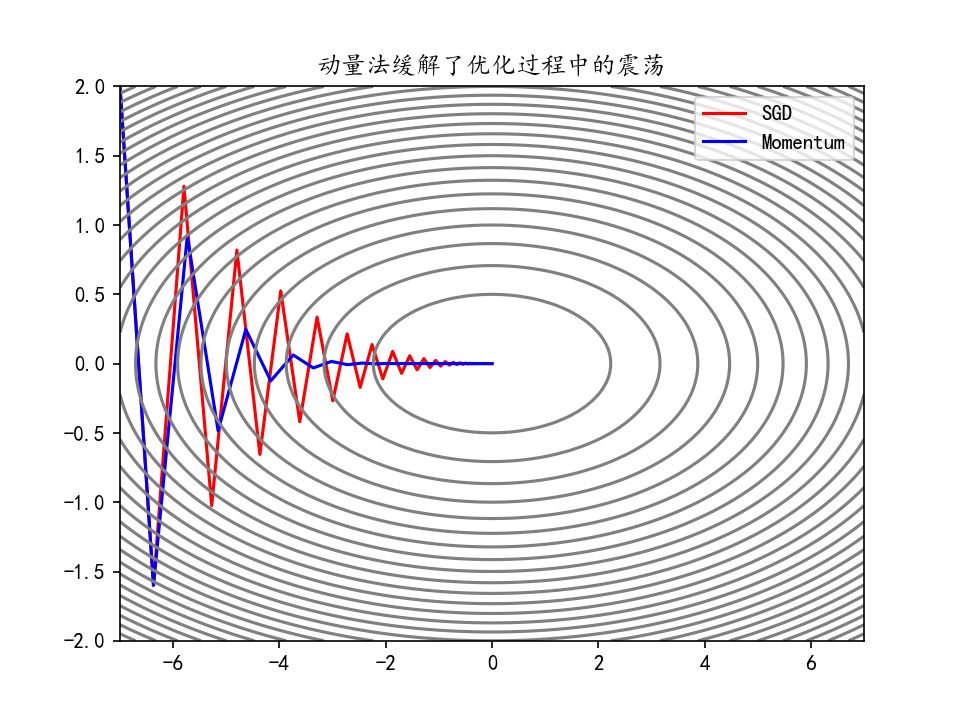

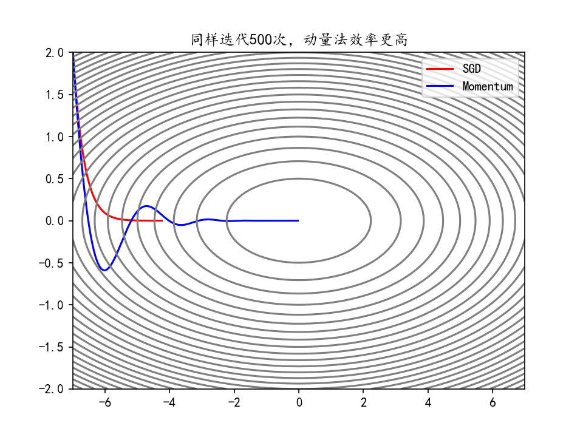

可以通过torch.optim.SGD() 并设置momentum历史梯度权重参数来使用动量法。

以寻找$f\left( x_{1},x_{2} \right)=0.05x_{1}^{2}+x_{2}^{2}$的最小值为例：

```python
import torch
import numpy as np
import matplotlib.pyplot as plt

def gradient_descent(X, optimizer, n_iters):
    X_arr = X.detach().numpy().copy()  # 拷贝，用于记录优化过程
    for epoch in range(n_iters):
        y = X**2 @ w
        y.backward()  # 反向传播
        optimizer.step()  # 更新参数
        optimizer.zero_grad()  # 清空梯度
        X_arr = np.vstack([X_arr, X.detach().numpy()])  # 记录优化过程
    return X_arr

# 从(-7, 2)出发
X = torch.tensor([-7, 2], dtype=torch.float32, requires_grad=True)
w = torch.tensor([[0.05], [1.0]], requires_grad=True)
lr = 1e-2  # 学习率
n_iters = 500  # 迭代次数

# 普通梯度下降
X_clone = X.clone().detach().requires_grad_(True)
X_arr1 = gradient_descent(X_clone, torch.optim.SGD([X_clone], lr=lr), n_iters=n_iters)
plt.plot(X_arr1[:, 0], X_arr1[:, 1], "r")

# 动量法
X_clone = X.clone().detach().requires_grad_(True)
X_arr2 = gradient_descent(X_clone, torch.optim.SGD([X_clone], lr=lr, momentum=0.9), n_iters=n_iters)
plt.plot(X_arr2[:, 0], X_arr2[:, 1], "b")

# 绘制等高线图
x1_grid, x2_grid = np.meshgrid(np.linspace(-7, 7, 100), np.linspace(-2, 2, 100))
y_grid = w.detach().numpy()[0, 0] * x1_grid**2 + w.detach().numpy()[1, 0] * x2_grid**2
plt.contour(x1_grid, x2_grid, y_grid, levels=30, colors="gray")
plt.legend(["SGD", "Momentum"])
plt.show()
```

### 学习率衰减

深度学习模型训练中调整最频繁的当属学习率，好的学习率可以使模型逐渐收敛并获得更好的精度。较大的学习率可以加快收敛速度，但可能在最优解附近震荡或不收敛；较小的学习率可以提高收敛的精度，但训练速度慢。学习率衰减是一种平衡策略，初期使用较大学习率快速接近最优解，后期逐渐减小学习率，使参数更稳定地收敛到最优解。

#### 等间隔衰减

每隔固定的训练周期（epoch），学习率按一定的比例下降，也称为“步长衰减”。例如，使学习率每隔20 epoch衰减为之前的0.7：

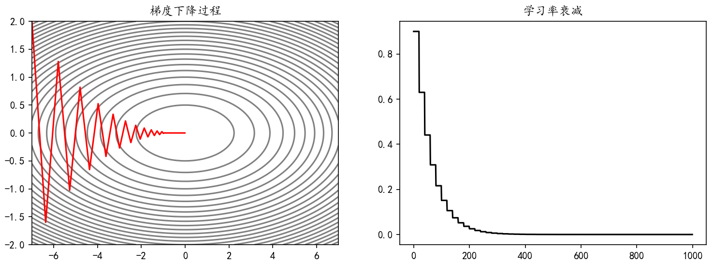

可以通过torch.optim.lr_scheduler.StepLR(optimizer, step_size, gamma)来实现学习率的等间隔衰减。

- optimizer：要实现学习率衰减的优化器
- step_size：间隔
- gamma：衰减的比例

代码如下：

```python
import torch
import numpy as np
import matplotlib.pyplot as plt

# 从(-7, 2)出发
X = torch.tensor([-7, 2], dtype=torch.float32, requires_grad=True)
w = torch.tensor([[0.05], [1.0]], requires_grad=True)
lr = 0.9  # 初始学习率
n_iters = 1000  # 迭代次数

optimizer = torch.optim.SGD([X], lr=lr)
scheduler_lr = torch.optim.lr_scheduler.StepLR(optimizer, step_size=20, gamma=0.7)  # 学习率衰减
X_arr = X.detach().numpy().copy()  # 拷贝，用于记录优化过程
lr_list = []  # 记录学习率变化
for epoch in range(n_iters):
    y = X**2 @ w
    y.backward()  # 反向传播
    optimizer.step()  # 更新参数
    optimizer.zero_grad()  # 清空梯度
    X_arr = np.vstack([X_arr, X.detach().numpy()])  # 记录优化过程
    lr_list.append(optimizer.param_groups[0]["lr"])  # 记录学习率变化
    scheduler_lr.step()  # 学习率衰减

plt.rcParams["font.sans-serif"] = ["KaiTi"]
plt.rcParams["axes.unicode_minus"] = False
fig, ax = plt.subplots(1, 2, figsize=(12, 4))
x1_grid, x2_grid = np.meshgrid(np.linspace(-7, 7, 100), np.linspace(-2, 2, 100))
y_grid = w.detach().numpy()[0, 0] * x1_grid**2 + w.detach().numpy()[1, 0] * x2_grid**2
ax[0].contour(x1_grid, x2_grid, y_grid, levels=30, colors="gray")
ax[0].plot(X_arr[:, 0], X_arr[:, 1], "r")
ax[0].set_title("梯度下降过程")

ax[1].plot(lr_list, "k")
ax[1].set_title("学习率衰减")
plt.show()
```

#### 指定间隔衰减

在指定的epoch，让学习率按照一定的系数衰减。例如，使学习率在epoch达到[10,50,200]时衰减为之前的0.7：

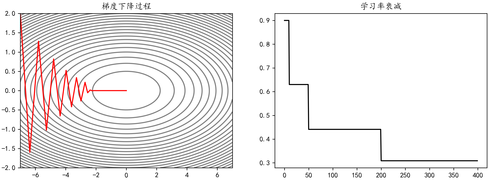

可以通过torch.optim.lr_scheduler.MultiStepLR(optimizer, milestones, gamma)来实现学习率的指定间隔衰减。

- optimizer：要实现学习率衰减的优化器
- milestones：指定衰减的间隔
- gamma：衰减的比例

代码如下：

```python
import torch
import numpy as np
import matplotlib.pyplot as plt

# 从(-7, 2)出发
X = torch.tensor([-7, 2], dtype=torch.float32, requires_grad=True)
w = torch.tensor([[0.05], [1.0]], requires_grad=True)
lr = 0.9  # 初始学习率
n_iters = 400  # 迭代次数

optimizer = torch.optim.SGD([X], lr=lr)
scheduler_lr = torch.optim.lr_scheduler.MultiStepLR(optimizer, milestones=[10, 50, 200], gamma=0.7)  # 学习率衰减
X_arr = X.detach().numpy().copy()  # 拷贝，用于记录优化过程
lr_list = []  # 记录学习率变化
for epoch in range(n_iters):
    y = X**2 @ w
    y.backward()  # 反向传播
    optimizer.step()  # 更新参数
    optimizer.zero_grad()  # 清空梯度
    X_arr = np.vstack([X_arr, X.detach().numpy()])  # 记录优化过程
    lr_list.append(optimizer.param_groups[0]["lr"])  # 记录学习率变化
    scheduler_lr.step()  # 学习率衰减

plt.rcParams["font.sans-serif"] = ["KaiTi"]
plt.rcParams["axes.unicode_minus"] = False
fig, ax = plt.subplots(1, 2, figsize=(12, 4))
x1_grid, x2_grid = np.meshgrid(np.linspace(-7, 7, 100), np.linspace(-2, 2, 100))
y_grid = w.detach().numpy()[0, 0] * x1_grid**2 + w.detach().numpy()[1, 0] * x2_grid**2
ax[0].contour(x1_grid, x2_grid, y_grid, levels=30, colors="gray")
ax[0].plot(X_arr[:, 0], X_arr[:, 1], "r")
ax[0].set_title("梯度下降过程")

ax[1].plot(lr_list, "k")
ax[1].set_title("学习率衰减")
plt.show()
```

#### 指数衰减

学习率按照指数函数${f\left( x \right)= a}^{x} ,  a<1$ 进行衰减。例如，使学习率以0.99为底数，epoch为指数衰减：

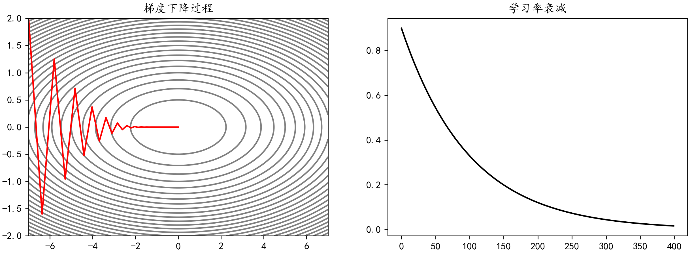

可以通过torch.optim.lr_scheduler.ExponentialLR(optimizer, gamma)来实现学习率的指数衰减。

- optimizer：要实现学习率衰减的优化器
- gamma：底数，$学习率←学习率×{gamma}^{epoch}$

代码如下：

```python
import torch
import numpy as np
import matplotlib.pyplot as plt

# 从(-7, 2)出发
X = torch.tensor([-7, 2], dtype=torch.float32, requires_grad=True)
w = torch.tensor([[0.05], [1.0]], requires_grad=True)
lr = 0.9  # 初始学习率
n_iters = 400  # 迭代次数

optimizer = torch.optim.SGD([X], lr=lr)
scheduler_lr = torch.optim.lr_scheduler.ExponentialLR(optimizer, gamma=0.99)  # 学习率衰减
X_arr = X.detach().numpy().copy()  # 拷贝，用于记录优化过程
lr_list = []  # 记录学习率变化
for epoch in range(n_iters):
    y = X**2 @ w
    y.backward()  # 反向传播
    optimizer.step()  # 更新参数
    optimizer.zero_grad()  # 清空梯度
    X_arr = np.vstack([X_arr, X.detach().numpy()])  # 记录优化过程
    lr_list.append(optimizer.param_groups[0]["lr"])  # 记录学习率变化
    scheduler_lr.step()  # 学习率衰减

plt.rcParams["font.sans-serif"] = ["KaiTi"]
plt.rcParams["axes.unicode_minus"] = False
fig, ax = plt.subplots(1, 2, figsize=(12, 4))
x1_grid, x2_grid = np.meshgrid(np.linspace(-7, 7, 100), np.linspace(-2, 2, 100))
y_grid = w.detach().numpy()[0, 0] * x1_grid**2 + w.detach().numpy()[1, 0] * x2_grid**2
ax[0].contour(x1_grid, x2_grid, y_grid, levels=30, colors="gray")
ax[0].plot(X_arr[:, 0], X_arr[:, 1], "r")
ax[0].set_title("梯度下降过程")

ax[1].plot(lr_list, "k")
ax[1].set_title("学习率衰减")
plt.show()
```

### AdaGrad

AdaGrad（Adaptive Gradient，自适应梯度）会为每个参数适当地调整学习率，并且随着学习的进行，学习率会逐渐减小。

$$
h←h+∇^{2}
$$

$$
W←W-η\frac{1}{\sqrt{h}}∇
$$

- $h$：历史梯度的平方和
- 这里${ ∇}^{2}$就表示了梯度的平方和，即 $\frac{∂L}{∂W} ⊙ \frac{∂L}{∂W}$ ，这里的$⊙$ 表示对应矩阵元素的乘法。

使用AdaGrad时，学习越深入，更新的幅度就越小。如果无止境地学习，更新量就会变为0，完全不再更新。

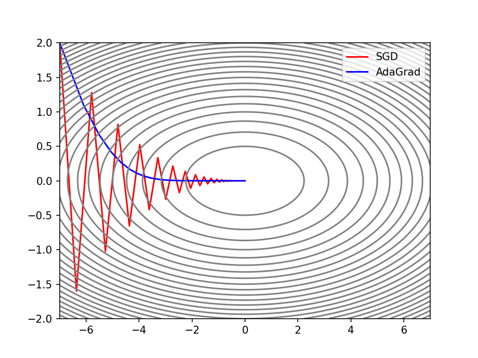

可以通过torch.optim.Adagrad()来使用AdaGrad。

同样以寻找$f\left( x_{1},x_{2} \right)=0.05x_{1}^{2}+x_{2}^{2}$的最小值为例：

```python
import torch
import numpy as np
import matplotlib.pyplot as plt

def gradient_descent(X, optimizer, n_iters):
    X_arr = X.detach().numpy().copy()  # 拷贝，用于记录优化过程
    for epoch in range(n_iters):
        y = X**2 @ w
        y.backward()  # 反向传播
        optimizer.step()  # 更新参数
        optimizer.zero_grad()  # 清空梯度
        X_arr = np.vstack([X_arr, X.detach().numpy()])  # 记录优化过程
    return X_arr

# 从(-7, 2)出发
X = torch.tensor([-7, 2], dtype=torch.float32, requires_grad=True)
w = torch.tensor([[0.05], [1.0]], requires_grad=True)
lr = 0.9  # 学习率
n_iters = 500  # 迭代次数

# 普通梯度下降
X_clone = X.clone().detach().requires_grad_(True)
X_arr1 = gradient_descent(X_clone, torch.optim.SGD([X_clone], lr=lr), n_iters=n_iters)
plt.plot(X_arr1[:, 0], X_arr1[:, 1], "r")

# AdaGrad
X_clone = X.clone().detach().requires_grad_(True)
X_arr2 = gradient_descent(X_clone, torch.optim.Adagrad([X_clone], lr=lr), n_iters=n_iters)
plt.plot(X_arr2[:, 0], X_arr2[:, 1], "b")

# 绘制等高线图
x1_grid, x2_grid = np.meshgrid(np.linspace(-7, 7, 100), np.linspace(-2, 2, 100))
y_grid = w.detach().numpy()[0, 0] * x1_grid**2 + w.detach().numpy()[1, 0] * x2_grid**2
plt.contour(x1_grid, x2_grid, y_grid, levels=30, colors="gray")
plt.legend(["SGD", "AdaGrad"])
plt.show()
```

### RMSProp

RMSProp（Root Mean Square Propagation，均方根传播）是在AdaGrad基础上的改进，它并非将过去所有梯度一视同仁的相加，而是逐渐遗忘过去的梯度，采用指数移动加权平均，呈指数地减小过去梯度的尺度。

$$
h←αh+\left( 1-α \right)∇^{2}
$$

$$
W←W-η\frac{1}{\sqrt{h}}∇
$$

- h：历史梯度平方和的指数移动加权平均
- $α$：权重

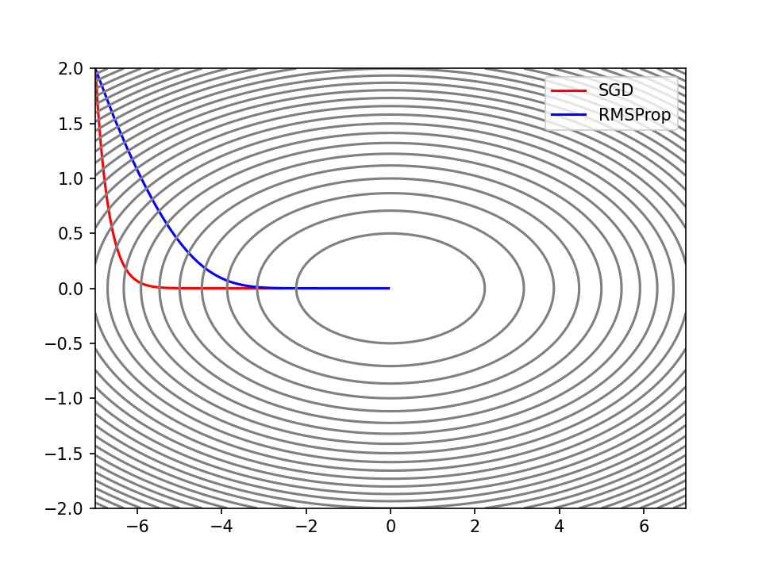

可以通过torch.optim. RMSprop ()并设置alpha权重参数来使用RMSprop。

同样以寻找$f\left( x_{1},x_{2} \right)=0.05x_{1}^{2}+x_{2}^{2}$的最小值为例：

```python
import torch
import numpy as np
import matplotlib.pyplot as plt

def gradient_descent(X, optimizer, n_iters):
    X_arr = X.detach().numpy().copy()  # 拷贝，用于记录优化过程
    for epoch in range(n_iters):
        y = X**2 @ w
        y.backward()  # 反向传播
        optimizer.step()  # 更新参数
        optimizer.zero_grad()  # 清空梯度
        X_arr = np.vstack([X_arr, X.detach().numpy()])  # 记录优化过程
    return X_arr

# 从(-7, 2)出发
X = torch.tensor([-7, 2], dtype=torch.float32, requires_grad=True)
w = torch.tensor([[0.05], [1.0]], requires_grad=True)
lr = 1e-1  # 学习率
n_iters = 1000  # 迭代次数

# 普通梯度下降
X_clone = X.clone().detach().requires_grad_(True)
X_arr1 = gradient_descent(X_clone, torch.optim.SGD([X_clone], lr=lr), n_iters=n_iters)
plt.plot(X_arr1[:, 0], X_arr1[:, 1], "r")

# RMSProp
X_clone = X.clone().detach().requires_grad_(True)
X_arr2 = gradient_descent(X_clone, torch.optim.RMSprop([X_clone], lr=lr, alpha=0.99), n_iters=n_iters)
plt.plot(X_arr2[:, 0], X_arr2[:, 1], "b")

# 绘制等高线图
x1_grid, x2_grid = np.meshgrid(np.linspace(-7, 7, 100), np.linspace(-2, 2, 100))
y_grid = w.detach().numpy()[0, 0] * x1_grid**2 + w.detach().numpy()[1, 0] * x2_grid**2
plt.contour(x1_grid, x2_grid, y_grid, levels=30, colors="gray")
plt.legend(["SGD", "RMSProp"])
plt.show()
```

### Adam

Adam（Adaptive Moment Estimation，自适应矩估计）融合了Momentum和AdaGrad的方法。

$$
v←α_{1}v+\left( 1-α_{1} \right)∇
$$

$$
h←α_{2}h+\left( 1-α_{2} \right)∇^{2}
$$

$$
\hat{v}=\frac{v}{1-α_{1}^{t}}
$$

$$
\hat{h}=\frac{h}{1-α_{2}^{t}}
$$

$$
W←W-η\frac{\hat{v}}{\sqrt{\hat{h}}}
$$

- $η$：学习率
- $α_{1}、α_{2}$：一次动量系数和二次动量系数
- $t$：迭代次数，从1开始

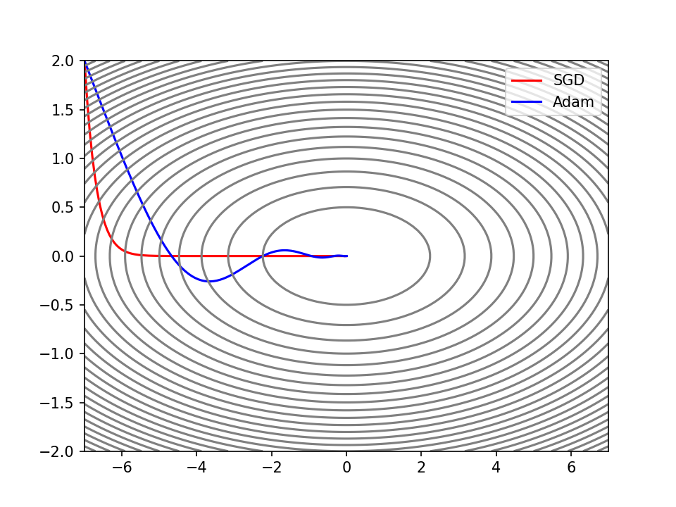

可以通过torch.optim. Adam ()并设置betas权重参数元组，其中包含两个权重参数，来使用Adam。

```python
import torch
import numpy as np
import matplotlib.pyplot as plt

def gradient_descent(X, optimizer, n_iters):
    X_arr = X.detach().numpy().copy()  # 拷贝，用于记录优化过程
    for epoch in range(n_iters):
        y = X**2 @ w
        y.backward()  # 反向传播
        optimizer.step()  # 更新参数
        optimizer.zero_grad()  # 清空梯度
        X_arr = np.vstack([X_arr, X.detach().numpy()])  # 记录优化过程
    return X_arr

# 从(-7, 2)出发
X = torch.tensor([-7, 2], dtype=torch.float32, requires_grad=True)
w = torch.tensor([[0.05], [1.0]], requires_grad=True)
lr = 1e-1  # 学习率
n_iters = 1000  # 迭代次数

# 普通梯度下降
X_clone = X.clone().detach().requires_grad_(True)
X_arr1 = gradient_descent(X_clone, torch.optim.SGD([X_clone], lr=lr), n_iters=n_iters)
plt.plot(X_arr1[:, 0], X_arr1[:, 1], "r")

# Adam
X_clone = X.clone().detach().requires_grad_(True)
X_arr2 = gradient_descent(X_clone, torch.optim.Adam([X_clone], lr=lr, betas=(0.9, 0.999)), n_iters=n_iters)
plt.plot(X_arr2[:, 0], X_arr2[:, 1], "b")

# 绘制等高线图
x1_grid, x2_grid = np.meshgrid(np.linspace(-7, 7, 100), np.linspace(-2, 2, 100))
y_grid = w.detach().numpy()[0, 0] * x1_grid**2 + w.detach().numpy()[1, 0] * x2_grid**2
plt.contour(x1_grid, x2_grid, y_grid, levels=30, colors="gray")
plt.legend(["SGD", "Adam"])
plt.show()
```

## 参数初始化

参数初始化方案的选择在神经网络学习中起着举足轻重的作用，它对保持数值稳定性至关重要。此外，这些初始化方案的选择可以与激活函数的选择有趣的结合在一起。我们选择哪个激活函数以及如何初始化参数，可以决定优化算法收敛的速度有多快；糟糕选择可能会导致我们在训练时遇到梯度爆炸或梯度消失。

### 常数初始化

所有权重参数初始化为一个常数，即

$$
W=k·J
$$

这里J为全1矩阵，k为初始化的常数。

PyTorch中，可以调用nn.init下的方法进行初始化：

```python
import torch.nn as nn

linear = nn.Linear(5, 2)

# 全部参数初始化为0
nn.init.zeros_(linear.weight)
print(linear.weight)

# 全部参数初始化为1
nn.init.ones_(linear.weight)
print(linear.weight)

# 全部参数初始化为一个常数
nn.init.constant_(linear.weight, 10)
print(linear.weight)
```

注意：将权重初始值设为0将无法正确进行学习。严格地说，不能将权重初始值设成一样的值。因为这意味着反向传播时权重全部都会进行相同的更新，被更新为相同的值（对称的值）。这使得神经网络拥有许多不同的权重的意义丧失了。为了防止“权重均一化”（瓦解权重的对称结构），必须随机生成初始值。

### 秩初始化

权重参数初始化为单位矩阵，即

$$
W=I
$$

这里I为单位矩阵，即主对角线上元素为1，其它元素为0。

```python
# 参数初始化为单位矩阵
nn.init.eye_(linear.weight)
print(linear.weight)
```

### 正态分布初始化

权重参数按指定均值μ与标准差σ正态分布初始化。因为不能直接将权重初始化为相同的常数，所以需要对参数进行随机初始化。最常见的随机分布就是 正态分布（也叫 高斯分布），记作 X ~ N(μ, σ2)。

其概率密度函数为：

$$
f(x)=\frac{1}{σ\sqrt{2π}}e^{-\frac{{(x-μ)}^{2}}{2σ^{2}}}
$$

```python
# 参数初始化为按指定均值与标准差正态分布
nn.init.normal_(linear.weight, mean=0.0, std=1.0)
print(linear.weight)
```

### 均匀分布初始化

权重参数在指定区间内均匀分布初始化。均匀分布一般记作 X ~ U(a, b)。

其概率密度函数为：

$$
f\left( x \right)=\frac{1}{b-a}，a<x<b
$$

$$
f\left( x \right)=0，x≤ a or x≥ b
$$

```python
# 参数初始化为在区间内均匀分布
nn.init.uniform_(linear.weight, a=0, b=10)
print(linear.weight)
```

### Xavier初始化（Glorot初始化）

Xavier初始化根据输入和输出的神经元数量调整权重的初始范围，确保每一层的输出方差与输入方差相近。

Xavier正态分布初始化：均值为0，标准差为$\sqrt{\frac{2}{n_{in}+n_{out}}}$的正态分布。

Xavier均匀分布初始化：区间$\left( -\sqrt{\frac{6}{n_{in}+n_{out}}},\sqrt{\frac{6}{n_{in}+n_{out}}} \right)$内均匀分布。

其中$n_{in}$表示输入数，$n_{out}$表示输出数。

```python
# Xavier正态分布初始化
nn.init.xavier_normal_(linear.weight)
print(linear.weight)

# Xavier均匀分布初始化
nn.init.xavier_uniform_(linear.weight)
print(linear.weight)
```

Xavier初始化参数适用于Sigmoid和Tanh等激活函数，能有效缓解梯度消失或爆炸问题。

### He初始化（Kaiming初始化）

He初始化根据输入的神经元数量调整权重的初始范围。

He正态分布初始化：均值为0，标准差为$\sqrt{\frac{2}{n_{in}}}$的正态分布。

He均匀分布初始化：区间$\left( -\sqrt{\frac{6}{n_{in}}},\sqrt{\frac{6}{n_{in}}} \right)$内均匀分布。

其中$n_{in}$表示输入数。

```python
# Kaiming正态分布初始化
nn.init.kaiming_normal_(linear.weight)
print(linear.weight)

# Kaiming均匀分布初始化
nn.init.kaiming_uniform_(linear.weight)
print(linear.weight)
```

He初始化参数主要适用于ReLU及其变体（如Leaky ReLU）激活函数。

## 正则化

机器学习的问题中，过拟合 是一个很常见的问题。

过拟合指的是能较好拟合训练数据，但不能很好地拟合不包含在训练数据中的其他数据。机器学习的目标是提高泛化能力，希望即便是不包含在训练数据里的未观测数据，模型也可以进行正确的预测。因此可以通过 正则化 方法来抑制过拟合。

常用的正则化方法有Batch Normalization、权值衰减、Dropout、早停法等。

### Batch Normalization批量标准化

Batch Normalization最重要的目的，其实是调整各层的激活值分布使其拥有适当的广度，BN层通常放在线性层（全连接层/卷积层）之后，激活函数之前。它有着以下优点：

- 可以使学习快速进行（允许更高的学习率）
- 不那么依赖初始值（对于初始值不用那么神经质）
- 抑制过拟合（降低Dropout等的必要性）

Batch Normalization会先对数据进行标准化，再对数据进行缩放和平移：

$$
均值：μ=\frac{1}{n}\sum x
$$

$$
方差：σ^{2}=\frac{1}{n}\sum {\left( x-μ \right)}^{2}
$$

$$
标准化：\hat{x}=\frac{x-μ}{\sqrt{σ^{2}+ε}}\left( ε为一个微小值，防止分母为0 \right)
$$

$$
缩放平移：y=γ\hat{x}+β
$$

- $ε$：一个微小值，防止分母为0
- $γ$：系数，可通过学习调整
- $β$：偏置，可通过学习调整

下图为Batch Normalization的计算图：

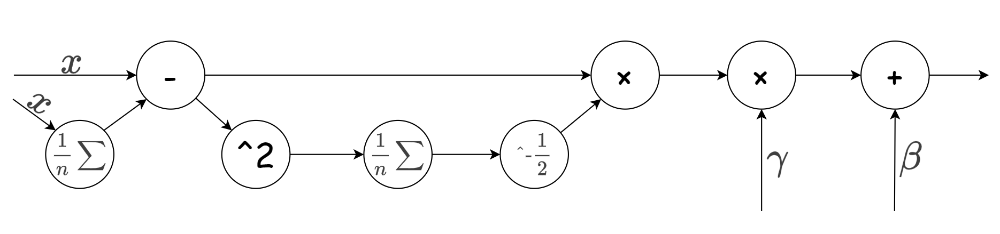

可以通过torch.nn下的_BatchNorm类来实现BN层，具体针对不同的输入形状，可以调用不同的子类（如 BatchNorm1d、BatchNorm2d）。

```python
import torch
bn = torch.nn.BatchNorm1d(num_features=3)
x = torch.randint(0, 10, (5, 3)).float()
y = bn(x)
print("BN转换前：", x)
print("BN转换后：", y)
```

### 权值衰减

通过在学习的过程中对大的权重进行“惩罚”，可以有效地抑制过拟合，这种方法被称为 权值衰减。因为很多过拟合产生的原因，就是权重参数取值过大。

一般会对损失函数加上一个权重的范数；最常见的就是 L2 范数的平方：

$$
L^{'}=L+ \frac{1}{2}·λ·{||W||}^{2}
$$

$|\left( W \right)|$：表示权重$W=(w_{1}, w_{1}, …,w_{1})$的L2范数，即$\sqrt{w_{1}^{2}+w_{2}^{2}+…{+ w}_{n}^{2}}$

$λ$: 控制正则化强度的超参数。

惩罚项$\frac{1}{2}·λ·{||W||}^{2}$求导之后得到 $λW$ ；所以在求权重梯度时，需要为之前误差反向传播法的结果，再加上$λW$。

在PyTorch的优化器中，默认使用L2正则化。正则化系数可以通过参数weight_decay来设置（默认为0）：

```python
from torch import optim
optimizer = optim.SGD(model.parameters(), lr=0.1, weight_decay=1e-2)
```

### Dropout随机失活

Dropout（随机失活，暂退法）是一种在学习的过程中随机关闭神经元的方法。

训练时以概率$p$随机关闭神经元，迫使网络不依赖特定神经元，增强鲁棒性，同时未被关闭的神经元的输出值以$\frac{1}{\left( 1-p \right)}$的比例进行缩放，以保持期望值不变；而测试时通常不使用Dropout，即所有神经元保持激活状态并且不进行缩放。

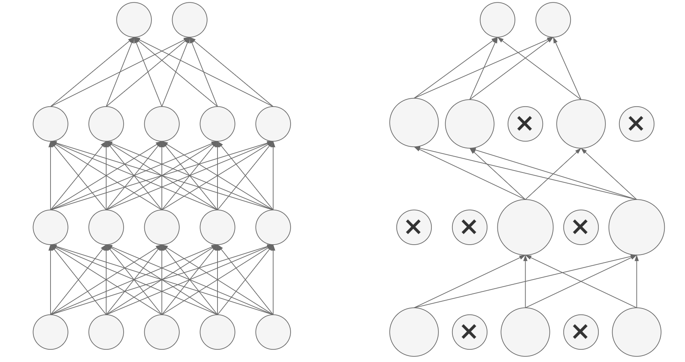

Dropout会有隐式集成的效果（每次迭代训练不同的子网络，测试时近似集成效果）。

Dropout在全连接层和卷积层均适用，尤其对大规模网络效果显著。Dropout通常放在激活函数之后，线性层（全连接层/卷积层）之前。

可以通过torch.nn.Dropout(p)来使用Dropout，并通过参数p来设置失活概率。

```python
import torch
dropout = torch.nn.Dropout(p=0.5)
x = torch.randint(1, 10, (10,), dtype=torch.float32)
print("Dropout前：", x)
print("Dropout后：", dropout(x))
```

## 应用案例：房价预测

先安装pandas和scikit-learn库：pip install pandas scikit-learn。

使用House Prices数据集：https://www.kaggle.com/c/house-prices-advanced-regression-techniques。

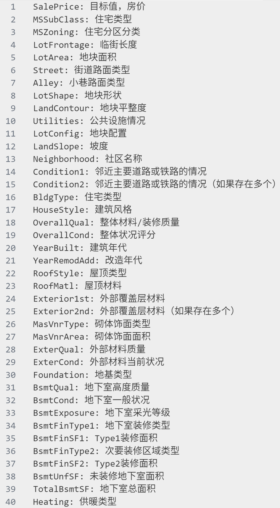

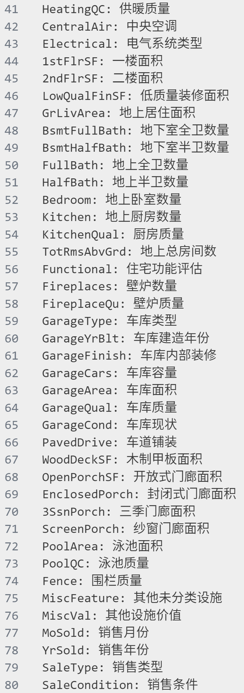

### 导入所需的模块

```python
import torch
import pandas as pd
import torch.nn as nn
import matplotlib.pyplot as plt
from sklearn.model_selection import train_test_split
from sklearn.pipeline import Pipeline
from sklearn.impute import SimpleImputer
from sklearn.compose import ColumnTransformer
from sklearn.preprocessing import StandardScaler, OneHotEncoder
from torch.utils.data import TensorDataset, DataLoader
```

### 特征工程

对特征进行处理，数值型特征使用均值填充缺失值，再标准化；类别型特征使用字符串“NaN”填充缺失值，再独特编码。之后构造数据集：

```python
def create_dataset():
    """构造数据集"""
    # 读取数据
    data = pd.read_csv("data/house_prices.csv")
    # 去除无关特征
    data.drop(["Id"], axis=1, inplace=True)
    # 划分特征和目标
    X = data.drop("SalePrice", axis=1)
    y = data["SalePrice"]
    # 筛选出数值型特征
    numerical_features = X.select_dtypes(exclude="object").columns
    # 筛选出类别型特征
    categorical_features = X.select_dtypes(include="object").columns
    # 划分训练集和测试集
    x_train, x_test, y_train, y_test = train_test_split(X, y, test_size=0.2, random_state=42)
    # 特征预处理
    #   数值型特征先用平均值填充缺失值，再进行标准化
    numerical_transformer = Pipeline(
        steps=[
            ("fillna", SimpleImputer(strategy="mean")),
            ("std", StandardScaler()),
        ]
    )
    #   类别型特征先将缺失值替换为字符串"NaN"，再进行独热编码
    categorical_transformer = Pipeline(
        steps=[
            ("fillna", SimpleImputer(strategy="constant", fill_value="NaN")),
            ("onehot", OneHotEncoder(handle_unknown="ignore")),
        ]
    )
    #   组合特征预处理器
    preprocessor = ColumnTransformer(
        transformers=[
            ("num", numerical_transformer, numerical_features),
            ("cat", categorical_transformer, categorical_features),
        ]
    )
    #   进行特征预处理
    x_train = pd.DataFrame(preprocessor.fit_transform(x_train).toarray(), columns=preprocessor.get_feature_names_out())
    x_test = pd.DataFrame(preprocessor.transform(x_test).toarray(), columns=preprocessor.get_feature_names_out())
    # 构建数据集
    train_dataset = TensorDataset(torch.tensor(x_train.values).float(), torch.tensor(y_train.values).float())
    test_dataset = TensorDataset(torch.tensor(x_test.values).float(), torch.tensor(y_test.values).float())
    # 返回训练集，测试集，特征数量
    return train_dataset, test_dataset, x_train.shape[1]

train_dataset, test_dataset, feature_num = create_dataset()
```

### 搭建模型

```python
# 搭建模型
model = nn.Sequential(
    nn.Linear(feature_num, 128),
    nn.BatchNorm1d(128),
    nn.ReLU(),
    nn.Dropout(0.2),
    nn.Linear(128, 1),
)
```

### 损失函数

关于房价的预测我们更加关心相对误差$\frac{\hat{y}-y}{y}$而非绝对误差$\hat{y}-y$，比如房价原本20万元而误差10万元，那么误差可能难以接受；但若房价原本1000万元而误差为10万元，那误差可能并不算大。因此这里我们使用对数来衡量误差：

$$
Loss=\sqrt{\frac{1}{n}\sum_{i=1}^{n} {\left( \log(\hat{y})-\log(y) \right)}^{2}}
$$

```python
# 损失函数
def log_rmse(pred, target):
    mse = nn.MSELoss()
    pred.squeeze_()
    pred = torch.clamp(pred, 1, float("inf"))  # 限制输出在1到正无穷之间
    return torch.sqrt(mse(torch.log(pred), torch.log(target)))
```

### 模型训练

```python
# 模型训练
def train(model, train_dataset, test_dataset, lr, epoch_num, batch_size, device):
    def init_weight(layer):
        # 对线性层的权重进行初始化
        if type(layer) == nn.Linear:
            nn.init.xavier_normal_(layer.weight)

    model.apply(init_weight)  # 初始化参数
    model = model.to(device)  # 将模型加载到设备中
    optimizer = torch.optim.Adam(model.parameters(), lr=lr)  # 优化器

    train_loss_list = []  # 记录训练损失
    test_loss_list = []  # 记录验证损失
    for epoch in range(epoch_num):

        # 训练过程
        model.train()  # 将模型设置为训练模式
        train_loader = DataLoader(train_dataset, batch_size=batch_size, shuffle=True)
        train_loss_accumulate = 0
        # 训练模型
        for batch_count, (X, y) in enumerate(train_loader):
            # 前向传播
            X, y = X.to(device), y.to(device)
            output = model(X)
            # 反向传播
            loss_value = log_rmse(output, y)
            optimizer.zero_grad()
            loss_value.backward()
            optimizer.step()
            # 累加损失
            train_loss_accumulate += loss_value.item()
            # 打印进度条
            print(f"\repoch:{epoch:0>3}[{'='*(int((batch_count+1) / len(train_loader)* 50 )):<50}]", end="")
        this_train_loss = train_loss_accumulate / len(train_loader)  # 计算平均损失
        train_loss_list.append(this_train_loss)  # 记录训练损失

        # 验证过程
        model.eval()  # 将模型设置为评估模式
        test_loader = DataLoader(dataset=test_dataset, batch_size=batch_size, shuffle=True)
        test_loss_accumulate = 0
        with torch.no_grad():  # 关闭梯度计算
            for X, y in test_loader:
                # 前向传播
                X, y = X.to(device), y.to(device)
                output = model(X)
                # 累加损失
                loss_value = log_rmse(output, y)
                test_loss_accumulate += loss_value.item()
        this_test_loss = test_loss_accumulate / len(test_loader)  # 计算平均损失
        test_loss_list.append(this_test_loss)  # 记录验证损失

        # 打印训练损失，验证损失
        print(f" train_loss:{this_train_loss:.6f}, test_loss:{this_test_loss:.6f}")
    return train_loss_list, test_loss_list

device = torch.device("cuda" if torch.cuda.is_available() else "cpu")  # 如果cude可用则使用cuda，否则使用cpu
train_loss_list, test_loss_list = train(model, train_dataset, test_dataset, 0.1, 200, 64, device)
plt.plot(train_loss_list, "r-", label="train_loss", linewidth=3)  # 绘制训练损失
plt.plot(test_loss_list, "k--", label="test_loss", linewidth=2)  # 绘制验证损失
plt.legend()
plt.show()
```
